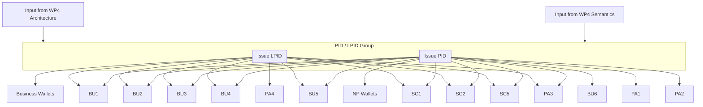

# WEBUILD Attestation Rulebooks and Schemas

## Repository description
This repository hosts the rulebooks and data schemas used across the WE BUILD Large Scale Pilot (LSP) use cases for the European Digital Identity (EUDI) ecosystem. It serves as a single source of truth for governance, interoperability, and compliance materials, including:

- Rulebooks that describe requirements, roles, processes, and conformance criteria for specific credentials and attestation types.
- Data schemas (e.g. SD-JWT based) that define how credential data is structured and validated.
- Sample data demonstrating expected payload shapes for implementers.

Project structure (high level):
- `rulebooks/` — Human‑readable rulebooks and regulatory references.
- `data-schemas/` — Machine‑readable schemas (e.g., JSON Schema for SD‑JWT claims), with samples under `sample-data/`.
- `sample-data/` — Additional example payloads that complement the schemas.

This repository is intended for implementers, partners, and reviewers who need to understand and validate the format and governance of credential data in EUDI wallet contexts.

## Dependencies

# Dependencies and Identifier Issuance

# PID/LPID Dependency Graph

## How to contribute
We welcome contributions that improve clarity, correctness, and coverage of rulebooks and schemas. To contribute:

1. Fork the repository and create a feature branch:
   - Branch name suggestion: `feat/<area>-<short-description>` or `fix/<area>-<short-description>`.
2. Make your changes:
   - For rulebooks: edit or add Markdown files under `rulebooks/` and keep terminology consistent with EUDI specifications.
   - For schemas: update or add JSON Schema files under `data-schemas/` and include at least one representative example under the corresponding `sample-data/` folder.
   - For samples: add minimal, realistic examples that pass schema validation.
3. Validate your changes locally (recommended):
   - Ensure JSON files are well‑formed.
   - If you introduce a schema, verify your sample(s) conform to it using any JSON Schema validator of your choice.
4. Open a Pull Request (PR):
   - Describe the intent and scope of your change and reference any related issues or external specs.
   - The repository includes a GitHub Actions workflow (`.github/workflows/validate-schemas.yml`) that will run basic checks on JSON files and schemas. Please ensure the checks pass.
5. Address review feedback:
   - Be responsive to comments and iterate as needed until approval.

### Contribution guidelines and tips
- Keep changes scoped and focused; separate unrelated updates into different PRs.
- Prefer additive changes when possible; avoid breaking changes unless necessary and clearly justified.
- Use clear commit messages and include context and rationale when updating rulebooks.
- Maintain consistency in file naming (lowercase with hyphens) and folder placement.
- British English spelling is preferred.

## License

This project is licensed under the Apache Licence, Version 2.0. See the repository's [LICENCE](LICENCE) file for
details. By contributing, you agree that
your contributions will be licensed under the same terms.
