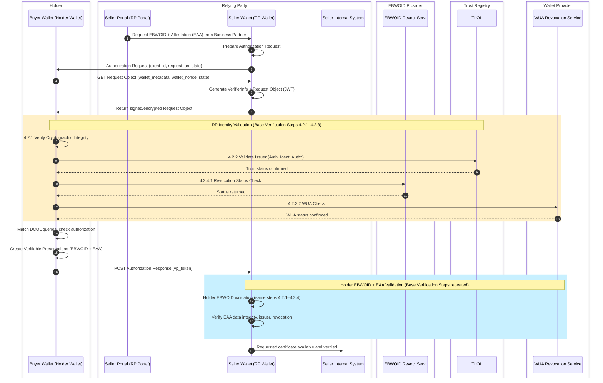

# Rulebook for mutual authentification   

*Provide information about the author(s) of this Rulebook in the following form:*

* Author(s):
  * [Folkendt Werner , Robert Bosch GmbH]
* 
* Reviewer(s):
  * [Florin Coptil, Robert Bosch GmbH]
  * [ .... ] 

*Provide versioning information about the Rulebook in the following form:*

| Version | Date       | Description                                                     |
|---------|------------|-----------------------------------------------------------------|
| 0.1     | 06.05.2026 | Initial draft based on the WeBuild design attestations mettings |

*Provide a contact email address and/or a link to an issue tracking system that can be used for
providing feedback, e.g.:*
Contact: 

**Feedback:**

## Intro
Overall Interaction Overview
The following diagram illustrates the overall flow of the mutual authentication scenario and highlights where base-verification steps are triggered:
