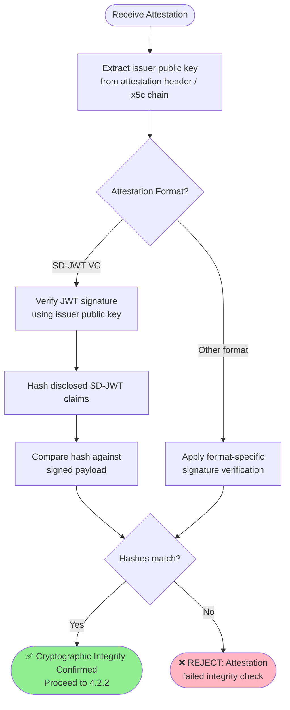
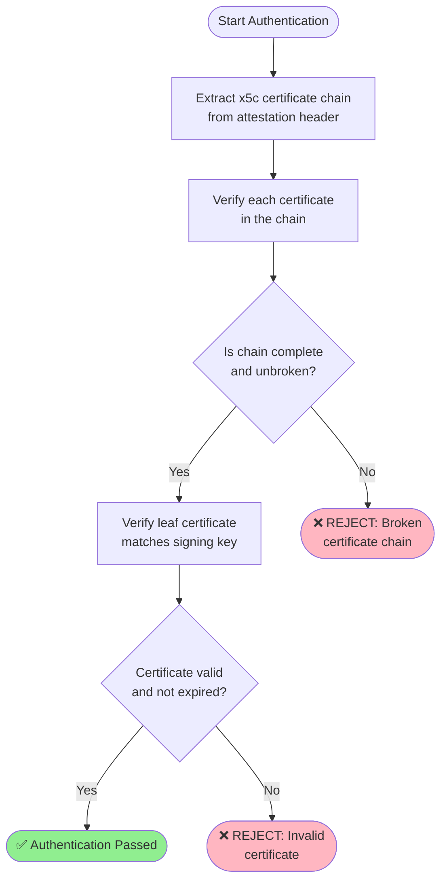
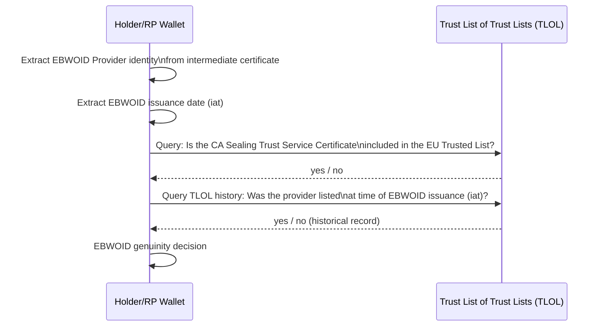
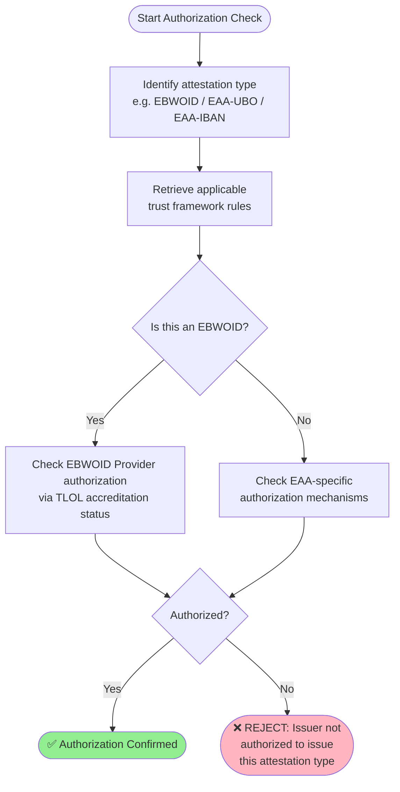
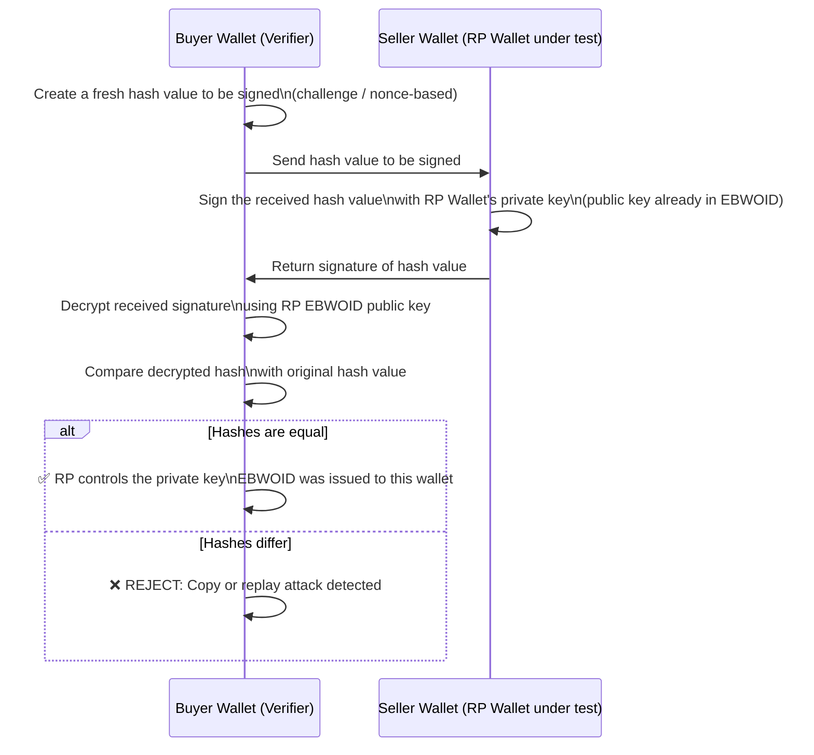
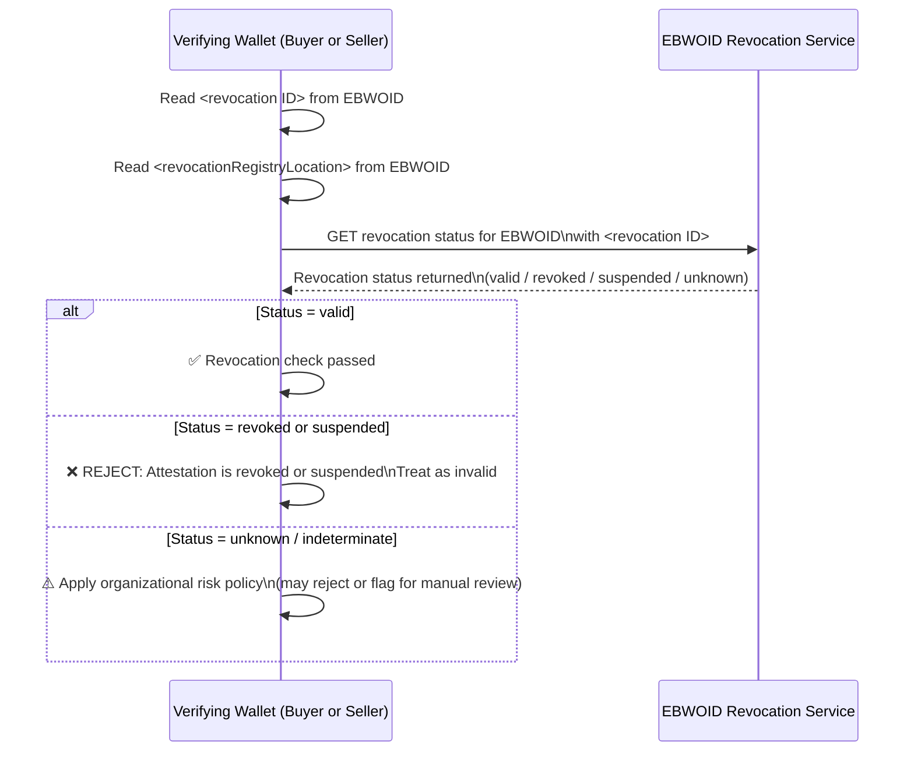
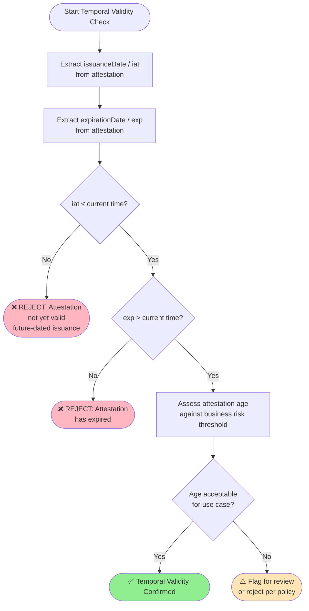

```mermaid
sequenceDiagram
    participant HW as Buyer Wallet (Verifier)
    participant SW as Seller Wallet (RP Wallet under test)
    HW->>HW: Create a fresh hash value to be signed\n(challenge / nonce-based)
    HW->>SW: Send hash value to be signed
    SW->>SW: Sign the received hash value\nwith RP Wallet's private key\n(public key already in EBWOID)
    SW->>HW: Return signature of hash value
    HW->>HW: Decrypt received signature\nusing RP EBWOID public key
    HW->>HW: Compare decrypted hash\nwith original hash value
    alt Hashes are equal
        HW->>HW: ✅ RP controls the private key\nEBWOID was issued to this wallet
    else Hashes differ
        HW->>HW: ❌ REJECT: Copy or replay attack detected
    end
```

# Rulebook for base-verification of the attestation  

*Provide information about the author(s) of this Rulebook in the following form:*

* Author(s):
  * [Folkendt Werner , Robert Bosch GmbH]
* 
* Reviewer(s):
  * [Florin Coptil, Robert Bosch GmbH]
  * [ .... ] 

*Provide versioning information about the Rulebook in the following form:*

| Version | Date       | Description                                                     |
|---------|------------|-----------------------------------------------------------------|
| 0.1     | 06.05.2026 | Initial draft based on the WeBuild design attestations mettings |

*Provide a contact email address and/or a link to an issue tracking system that can be used for
providing feedback, e.g.:*
Contact: 

**Feedback:**

## Intro
When a Relying Party (RP) receives an attestation, the immediate challenge is to determine whether the information it contains can be genuinely trusted. This document establishes the essential verification processes that an RP SHALL implement to ensure the integrity and authenticity of attestation data.

These foundational checks serve as the universal starting point for evaluating any attestation. The verification framework addresses two complementary perspectives:

- 1.Technical Validation – Verifying the attestation's cryptographic integrity and content
- 2.Issuance Process Validation – Scrutinizing how and by whom the attestation was created
This dual-pronged approach is critical for establishing confidence and clarifying liability within the attestation ecosystem. While the initial steps provide a common baseline, more intricate attestations (e.g., EBWOID, WUA, UBO) may necessitate additional verification measures beyond what is described here.

Important Note: This checklist represents the base verification applicable to all attestations. Specific attestation types (e.g., IBAN, EBWOID) may define additional verification steps in their respective rulebooks. 
The EBWOID rulebook in particular extends these base checks with the detailed mutual authentication process described in the EBWOID Attestation .
## 4.2 Relying Party Obligations ##

### 4.2.1 Verify Cryptographic Integrity ###
### Purpose
This step answers the fundamental question: Are the received attestation data falsified or corrupted during transmission?

This is the first and most fundamental verification step. Before any semantic trust decision is made, the Relying Party MUST confirm that the attestation data has not been tampered with since it was issued.

### Questions to be Covered
- Has the attestation been altered or corrupted during transmission?
- Does the digital signature over the attestation validate correctly against the issuer's public key?
- For SD-JWT VC: Are the disclosed claims consistent with the signed payload?
### 4.2.2 Validate Issuer ###

Steps
1. Extract the issuer's public key from the attestation header (e.g., from the x5c certificate chain embedded in the EBWOID header)
2. Decrypt/verify the digital signature over the attestation using the extracted public key
3. Hash the attestation payload and compare against the decrypted signature value
4. For SD-JWT VC:
- Verify the JWT signature
- Validate all disclosed claims against the signed commitment (hash comparison)
5. If hashes match → integrity confirmed; if not → REJECT the attestation

### 4.2.2 Validate Issuer ###
### Purpose
Once cryptographic integrity is confirmed, the Relying Party MUST validate who issued the attestation. This involves three interrelated but distinct checks: Authentication, Identification, and Authorization.

### Questions to be Covered
- Has the EBWOID Provider owned the private key used to sign the EBWOID?
- Is the EBWOID Provider the entity who they claim to be? (Identification)
- Was the EBWOID Provider included in the TLOL and therefore authorized when the EBWOID was issued? (Accreditation)
- Is the issuer authorized to issue the specific type of attestation being presented?

#### 4.2.2.1 Authentification ####

### Purpose
Confirm that the issuer actually possesses the private key corresponding to the public key used to sign the attestation. This is analogous to the verification performed today for a QESEAL certificate.

#### Questions to be Covered
- Does the certificate chain in the attestation header form a valid, unbroken chain up to a trusted root?
- Has each certificate in the chain been verified for integrity and validity?

### Overall Issuer Validation Flow

Steps
1. Extract the x5c certificate chain from the EBWOID header
2. Perform x5c header certificate verification as performed today for a QESEAL certificate
3. Verify each certificate in the chain from leaf to root:
- Validate certificate signatures
- Check certificate validity periods
- Verify certificate usage constraints (e.g., key usage, extended key usage)
4. Confirm the leaf certificate's public key matches the key used to sign the attestation

#### 4.2.2.2 Identification ####

### Purpose
Verify that the EBWOID Provider is the entity they claim to be, and that they were listed in the Trust List of Trust Lists (TLOL) at the time the attestation was issued. This check must consider TLOL history since the TLOL may have changed since issuance.

### Questions to be Covered
- Is the EBWOID Provider's intermediate certificate listed in the EU Trusted List (TLOL)?
- Was the EBWOID Provider listed in the TLOL at the time the EBWOID was issued (historical check)?
- Does the identity declared in the certificate match the identity in the trust list?

### Process

### Steps
1. Extract the EBWOID Provider's identity from the intermediate certificate in the x5c chain
2. Retrieve the EBWOID issuance date (iat claim)
3. Query the TLOL: Is the CA Sealing Trust Service Certificate included in the EU Trusted List?
4. Additionally check TLOL history: Was the EBWOID Provider listed in the TLOL at the time the EBWOID was issued?
5. If both current and historical checks pass → EBWOID genuinity confirmed
6. If either check fails → REJECT

#### 4.2.2.3 Authorization ####

### Purpose
Verify that the issuer is authorized to issue the specific type of attestation being presented (e.g., EBWOID, UBO, Payment Terms). This goes beyond identity verification to check whether the issuer has the legal and regulatory right to issue the specific attestation.

### Questions to be Covered
- Is the issuer authorized to issue EBWOIDs (or the specific EAA type)?
- Does the issuer's authorization align with the applicable trust framework?
- For EAAs: What authorization mechanisms confirm the issuer's rights?

### Process

### Steps
1. Identify the type of attestation being verified (EBWOID, EAA-UBO, EAA-IBAN, etc.)
2. Retrieve the applicable trust framework rules for that attestation type (see Chapter 5)
3. For EBWOID: Verify that the EBWOID Provider's accreditation in the TLOL explicitly covers the authorization to issue EBWOIDs
4. For EAA (e.g., UBO): Confirm issuer authorization mechanisms specific to that EAA type:
Check the issuer's credentials against the appropriate trust framework
Verify the issuer is listed as an authorized EAA issuer for the relevant jurisdiction/domain
5. If all authorization checks pass → proceed; otherwise → REJECT

### 4.2.3 Holder Wallet Related check ###

#### Purpose
These checks verify the integrity and authenticity of the wallet instance presenting the attestation. The goal is to prevent impersonation, copy attacks, and replay attacks by confirming that:

The wallet presenting the EBWOID actually controls the private key bound to it (device/wallet binding)
The Wallet Unit Attestation (WUA) confirms the wallet is a legitimate, certified EBW instance

"The EBW wallet is much more secure and prevent impersonation fraud much better than an unknown, uncertified Relying Party software without any conformity declaration."

#### 4.2.3.1.Device binding  ####

### Purpose
Answer the question: Does the EBW Relying Party wallet control, at the moment of the check, the private key associated with the public key from the EBWOID?

This check prevents a malicious actor from copying an EBWOID and replaying it from a different wallet instance.

### Questions to be Covered
- Does the presenting wallet currently control the private key associated with the public key embedded in the EBWOID?
- Was the EBWOID issued to this specific wallet (wallet-bound issuance)?
- Was the Relying Party in possession of the public and private key pair at the time the EBWOID was issued?

### Process

Steps
1. The verifying wallet (Buyer Wallet) creates a fresh hash value (challenge) to be signed
2. The hash value is sent to the Relying Party wallet (Seller Wallet)
3. The Seller Wallet signs the received hash value with its private key (the corresponding public key is already included in the EBWOID)
4. The signature is returned to the Buyer Wallet
5. The Buyer Wallet decrypts the received signed hash using the RP EBWOID public key
6. If the two hash values are equal → the requesting RP controls the private key and the EBWOID provider has issued the EBWOID to this specific RP EBW instance
7. If not equal → REJECT (copy or replay attack)

#### 4.2.3.1.WUA check ####
### Purpose
Answer the question: Is the EBW authentic and valid based on the Wallet Unit Attestation (WUA)?

The WUA is a certified attestation issued by the Wallet Provider that proves the wallet instance is a legitimate, certified, and conformant European Business Wallet.

### Questions to be Covered
1. Is the Wallet Unit Attestation (WUA) cryptographically valid?
2. Has the WUA been revoked?
3. Does the WUA confirm the wallet is a certified EBW instance?

Process

Steps
1. Extract the WUA from the received VerifierInfo object (included by the RP in the presentation request) or from the Holder's presented credentials
2. Apply 4.2.1 Cryptographic Integrity check on the WUA
3. Apply 4.2.2 Issuer Validation on the WUA (verify the Wallet Provider's identity and authorization)
4. Query the WUA Revocation Service to confirm the WUA has not been revoked
5. Verify the WUA's validity dates (issuance and expiration)
If all checks pass → wallet confirmed as authentic and valid EBW
7. If any check fails → REJECT

### 4.2.4 Holder Related check ###

### Purpose
These checks verify properties of the attestation itself in relation to its holder and lifecycle status. Even if the issuer is trusted and the wallet is authenticated, the attestation itself may have been revoked or may have expired.

### Questions to be Covered
- Has the attestation been revoked since the beginning of its validity period?
- Is the attestation still within its valid time window?
- How should indeterminate revocation status be handled (policy decision)?

#### 4.2.4.1. Revocation status check ####
### Purpose
Answer the question: Was the attestation revoked since the beginning of the validity period?

A cryptographically valid attestation from an authenticated issuer may still be invalid if the issuer has explicitly revoked it (e.g., due to key compromise, legal changes, or business relationship termination).

### Questions to be Covered
- Has the EBWOID (or EAA) been revoked by its issuer?
- What is the revocation mechanism used (e.g., status list, revocation registry)?
- How should suspended or indeterminate status be handled?

Process

Steps
1. Read the <revocation ID> from the EBWOID (or EAA)
2. Read the <revocationRegistryLocation> from the EBWOID (or EAA)
3. Query the designated revocation/status service at the specified location
4. Evaluate the returned status:
- Valid → proceed
- Revoked or Suspended → REJECT, treat as invalid
- Unknown/Indeterminate → handle according to organizational risk policy
5. Apply the revocation decision to the overall attestation validation outcome

#### 4.2.4.2. Check Temporal Validity ####
#### Purpose
Verify that the attestation is within its stated validity window. An attestation that has not yet taken effect or has already expired MUST NOT be accepted, regardless of other checks.

#### Questions to be Covered
1. Was the attestation issued in the past (not a future-dated attestation)?
2. Has the attestation's expiration date been reached?
3. How does the attestation's age factor into business risk considerations?

Process

Steps
1. Extract the issuanceDate / iat (issued at) claim from the attestation
2. Extract the expirationDate / exp (expiration) claim from the attestation
3. Verify iat ≤ current time:
- If iat is in the future → REJECT (attestation not yet valid / future-dated)
4Verify exp > current time:
- If current time has passed exp → REJECT (attestation has expired)
5. Consider attestation age in relation to business risk:
- For high-risk operations (e.g., large financial transactions), even a recently-issued but older attestation may warrant additional scrutiny
- Apply organizational policy for acceptable attestation age thresholds

## References

| **Item Reference**                            | **Standard name/details**                                                                                                                                                                                                                                                                           |
|-----------------------------------------------|-----------------------------------------------------------------------------------------------------------------------------------------------------------------------------------------------------------------------------------------------------------------------------------------------------|
| OpenID for Verifiable Presentations (OID4VP)	 |Protocol specification for presentation requests including VerifierInfo objects|
| eIDAS 2.0 / EUDIW ARF                         |	European Digital Identity Wallet Architecture and Reference Framework|
| WE BUILD BU1 KYC Specification v0.7	          |Specification Scenarios |
| EBWOID Rulebook	                              |Specific rules for EBWOID issuance, validation, and revocation|
| TLOL / EU Trusted Lists	                      |Trust List of Trust Lists maintained by national Supervisory Bodies|
| SD-JWT VC Specification	                      |Format specification for Selective Disclosure JWT Verifiable Credentials|

