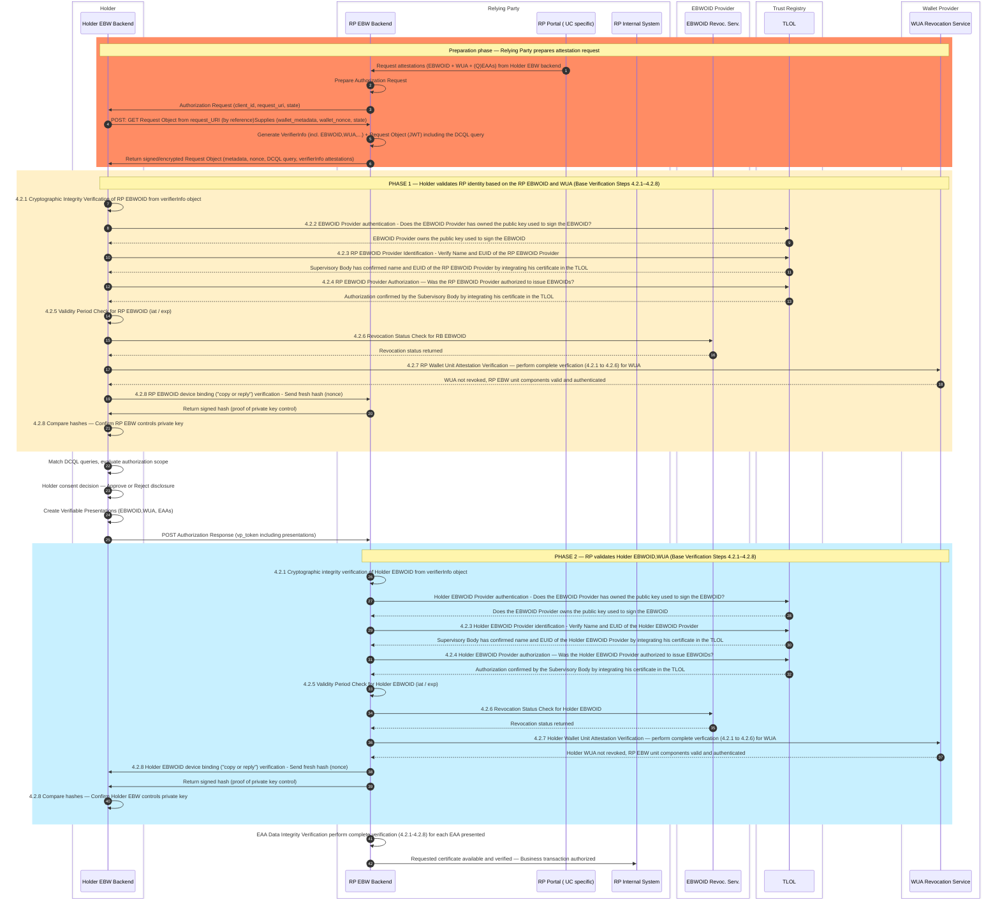
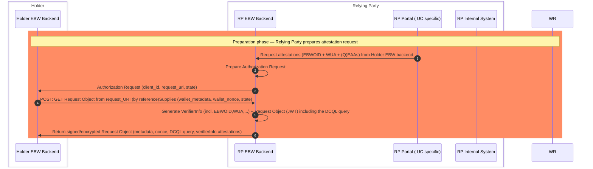

# Rulebook for Mutual Identification & Consent Handshake 
*Provide information about the author(s) of this Rulebook in the following form:*

* Author(s):
  * [Folkendt Werner , Robert Bosch GmbH]
* 
* Reviewer(s):
  * [Florin Coptil, Robert Bosch GmbH]
  * [ .... ] 

*Provide versioning information about the Rulebook in the following form:*

| Version | Date         | Description                                                     |
|---------|--------------|-----------------------------------------------------------------|
| 0.1     | 	06.05.2026	 |Initial draft based on the WeBuild design attestations meetings|
| 0.2     | 	06.05.2026	 |Updated with Base Verification integration (steps 4.2.1–4.2.8) from base-verification rulebook|

*Contact email address and/or a link to an issue tracking system that can be used for
providing feedback: werner.folkendt@de.bosch.com*
Contact: 

**Feedback:**

### 1. Introduction
This document defines the Mutual Identification & Consent Handshake workflow, which is performed at the beginning of an interaction between a Holder Wallet and a Relying Party Wallet.
[Open Topic: The Relying Party Wallet may be also a "EBW Relying Party Component" depending on the specification of such a component and the confidentiality of the requested data.]
The context of this workflow is an use case where a Relying Party EBW requests (Q)EAAs from a Holder EBW.
The workflow consists of two complementary steps:
- Holder	EBW backend MUST verify the Relying Parties EBW backend identity, authorization, and wallet integrity before presenting requested attestations, that might be highly confidential.
- Relying Party EBW backend MUST verify the requested Holder's identity and wallet integrity before the requsted attestation are verified  

The first step requires that the Relying Party provides with each attestation request also a verifierInfo object (according to "OpenID for Verifiable Presentations (OID4VP)" specification) including attestations that are required by the Holder EBW to decide if the request is answered. If the RP uses an EBW the verifierInfo object must contain the EBWOID, the WUA attestations and optionaly additional authorization attestations. The EBWOID is the identity attestation with the highest legal value and enables RP identification. The WUA attestation enables the RP's wallet integrity and wallet revocation check. Additional attestations may be used to decide if the requested data can be presented according to the EBW owner internal policies. After these attestations are verified by the Holder EBW the holder can decide according to his policies and regulatory constraints if he presents the requested attestations.

This document builds directly upon the base-verification rulebook [(https://github.com/webuild-consortium/webuild-attestation-rulebooks-catalog/blob/main/rulebooks/rb-base/verifier-base-verification.md)]
in which the common mandatory verification steps for all attestations are defined. All verification steps referenced here (4.2.1–4.2.8) are defined in that document. 

### 2. Scope

This rulebook applies when a RP EBW backend requests attestations from a Holder EBW backend and also during additional wallet to wallet transactions. [Open topic: The additional wallet-to-wallet interactions where mutual identification is required still need to be defined (e.g. attestation issuing initiated by the issuer,...)]
The described flow applies the above verifications steps in both directions — the Holder EBW identifies the RP and decides if the requested attestations can be presented according to the holder EBW owners internal policies and regulatory constraints.The RP EBW verifies the Holder EBW identity and wallet integrity before verifying additional received attestations.

### 3. Overall Interaction Overview
The actors in the interaction diagram are the following software systems:

Software systems owned by the holder EBW owner
- Holder EBW Backend: EBW wallet backend of the Holder that acts in the holder role during this workflow and also verifies attestations presented by a requester wallet to identify the requester and to trust the RP EBW
- Holder EBW Frontend: EBW wallet frontend of the Holder that may interacts wit the Holder EBW backend if verification or presentation decisions are made by a natural person

Software systems owned by the RP EBW owner
- RB EBW Backend: EBW wallet backend of the RP that acts primarily in the Relying Party role but also provides attestations included in the the verifierInfo object that enable the holder to identify and trust the RP EBW
- RP Portal: Web application owned by the RP legal entity that may act as a frontend for Holder EBW owner employees. The RB Portal component uses the internal system API of the EBW to interact with the EBW. It may implement additional responsibilities like: 
   - act based on (e.g. KyC) specific logic.
   - triggers the attestation requests
   - performs additional attestation type specific verification steps
   - transfer data to internal systems
  The EBW owner decides based on his enterprise architecture how these responsibilities are distributed to hin internal systems. In the interaction diagram the above functionalities are assigned to the RB Portal component.
- RP Internal System: ICT systems owned by the RP, in which the presented data are transferred e.g. enterprise relationship management system or customer master data management system.

Software systems owned by the EBWOID provider
- EBWOID revocation service: Revocation service for the EBWOID 

Software systems for which the national Supervisory Body is responsible
- Trust List that are part of the TLOL and include the EBWOID provider certificates

Software systems for which the Wallet Provider is responsible
- WUA revocation service: Revocation service for the WUA

The following diagram illustrates the complete mutual authentication flow and explicitly marks where base-verification steps are triggered on each side. The phases are explained in detail in subsequent interaction diagrams where only the actors required for the specific phase are included:

### 4. Workflow Phases
## 4.1 Preparation phase - Relying Party prepares attestation request including own attestations

The RP EBW backend receives a request from an internal system to request(Q)EAAs from an EBW owner. 

The RB Portal has created the DCQL query object and the verifierInfo object. The verifierInfo object MUST contain the EBWOID, the WUA and if required by the Holder optional additional authorization attestations.
The DCQL query MUST include the query for the holders EBWOID and the WUA to enable holder identity and holder EBW integrity verification. 

[Open topics: 
- Which data need to be provided via the internal system API of the EBW wallet? Only the EUID or also the endpoint of the Holder EBW?
- Do we need a HAIP document to define the verifierInfo object]

## 4.2 Phase 1 — Holder identifies the Relying Party and checks RP EBW integrity
Trigger: The Holder Wallet receives a signed/encrypted Authorization Request Object from the RP Wallet.

Obligation: Before disclosing any credentials, the Holder MUST validate the RP's trustworthiness by applying the base verification steps to the RP's attestations included in the verifierInfo object.

All steps below reference the basic verification rulebook. In this rulebook they are defined in detail and the rationals behind each step is described. The rationales were formulated in the Architecture and Reference Framework V1.3. The following steps are listed to show for which attestations the steps are performed.

4.2.1 Cryptographic integrity verification of Holder EBWOID from verifierInfo object

4.2.2 Holder EBWOID Provider authentication - Does the EBWOID Provider has owned the public key used to sign the EBWOID?

4.2.3 Holder EBWOID Provider identification - Verify Name and EUID of the Holder EBWOID Provider

4.2.4 Holder EBWOID Provider authorization — Was the Holder EBWOID Provider authorized to issue EBWOIDs?

4.2.5 Validity Period Check for Holder EBWOID  (iat / exp)

4.2.6 Revocation Status Check for Holder EBWOID

4.2.7 RP Wallet Unit Attestation Verification — perform complete verfication (4.2.1 to 4.2.6 and 4.2.8) for WUA to check revocation and that RB EBW unit componants are valid and authentic 

4.2.8 RP EBWOID device binding ("copy or reply") verification 

Outcome of Phase 1:

## 4.3 Holder consent decision
After successfully completing Phase 1 validation, the Holder EBW backend performs the following steps:
- DCQL Query Match: Match the request to the own attestations stored in the wallet.
- Minimal Disclosure: Only the attributes required by the RP need to be disclosed. 
- Consent decision based on internal policy check: Decides if the requested attestations can be presented according to the EBW owners internal policies.

The consent decision can be made:
- automatically based on the EBW wallet configuration
- automatically based on additional authorization attestation included in the verifierInfo object
- manually by one or more employees of the EBW owner
The decision will allway be based on the EBW owner internal policies that are based on EU and national regulations.

If the internal policy check is successful consent is granted → the Holder creates Verifiable Presentations (VP Token) containing the EBWOID and the requested (Q)EAA(s) and sends them to the RP.

If the internal policy check is not successful consent is denied → the workflow terminates; no attestations are presented.

[Opent topics: 
- The mechanism to notify EBW owner employees is not defined
- the messages for answering the request of the RP is not defined for the case that the consent is denied
- the configuration of the wallet that enables automatic decisions is not defined
- the authorization attestation in the verifierInfo object are not defined and also the wallet behaviour for this case is not specified.]

## 4.4 Phase 2 — RP EBW backend identifies the Holder and checks Holder EBW integrity
Trigger: The RP Wallet receives the VP Token (Authorization Response) from the Holder Wallet.

Obligation: The RP MUST apply the full base verification steps to the Holder's presented EBWOID and WUA before accepting the transaction.

All steps below reference the basic verification rulebook. In this rulebook they are defined in detail and the rationals behind each step is described. The rationales were formulated in the Architecture and Reference Framework V1.3. The following steps are listed to show for which attestations the steps are performed.

4.2.1 Cryptographic integrity verification of Holder EBWOID from verifierInfo object

4.2.2 Holder EBWOID Provider authentication - Does the EBWOID Provider has owned the public key used to sign the EBWOID?

4.2.3 Holder EBWOID Provider identification - Verify Name and EUID of the Holder EBWOID Provider

4.2.4 Holder EBWOID Provider authorization — Was the Holder EBWOID Provider authorized to issue EBWOIDs?

4.2.5 Validity Period Check for Holder EBWOID  (iat / exp)

4.2.6 Revocation Status Check for Holder EBWOID

4.2.7 Holder Wallet Unit Attestation Verification — perform complete verfication (4.2.1 to 4.2.6) for WUA to check WUA revocation state and that the Holder EBW unit components are valid and authenticated.

4.2.8 Holder EBWOID device binding ("copy or reply") verification to avoid impersonation

## 4.5 Additional (Q)EAA verification
Each presented (Q)EAA is validated according the attestation specific rulebook containing the reference to the basic verification rulebook.

Outcome of Phase 2 and the additional (Q)EAA verification

## References 

 | **Item Reference**                           | **Standard name/details**                                                                                                                                                                                                                                                                           |
 |----------------------------------------------|-----------------------------------------------------------------------------------------------------------------------------------------------------------------------------------------------------------------------------------------------------------------------------------------------------|
 | Item Reference	                              |Standard name/details|
 | base-verification rulebook	                  |Base verification steps 4.2.1–4.2.8 — full process definitions|
 | OpenID for Verifiable Presentations (OID4VP) |	Protocol specification for presentation requests including VerifierInfo objects|
 | eIDAS 2.0 / EUDIW ARF                        |	European Digital Identity Wallet Architecture and Reference Framework|
 | WE BUILD BU1 KYC                             |Specification v0.7	Specification Scenarios|
 | EBWOID Rulebook	                             |Specific rules for EBWOID issuance, validation, and revocation|
 | TLOL / EU Trusted Lists	                     |Trust List of Trust Lists maintained by national Supervisory Bodies|
 | SD-JWT VC Specificatio                       |Format specification for Selective Disclosure JWT Verifiable Credentials|
