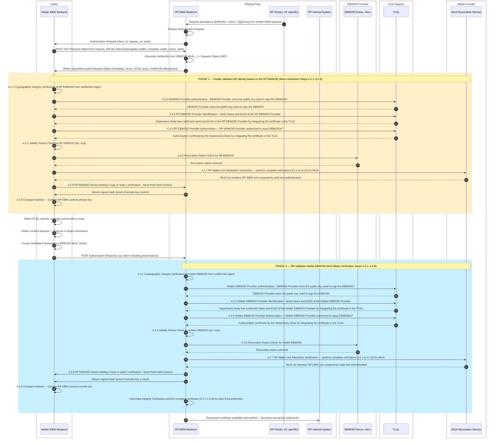
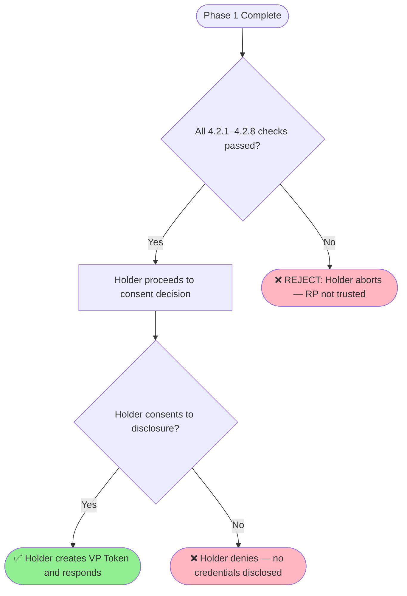

# Rulebook for Mutual Identification & Consent Handshake 
*Provide information about the author(s) of this Rulebook in the following form:*

* Author(s):
  * [Folkendt Werner , Robert Bosch GmbH]
* 
* Reviewer(s):
  * [Florin Coptil, Robert Bosch GmbH]
  * [ .... ] 

*Provide versioning information about the Rulebook in the following form:*

| Version | Date         | Description                                                     |
|---------|--------------|-----------------------------------------------------------------|
| 0.1     | 	06.05.2026	 |Initial draft based on the WeBuild design attestations meetings|
| 0.2     | 	06.05.2026	 |Updated with Base Verification integration (steps 4.2.1–4.2.8) from base-verification rulebook|

*Contact email address and/or a link to an issue tracking system that can be used for
providing feedback: werner.folkendt@de.bosch.com*
Contact: 

**Feedback:**

### 1. Introduction
This document defines the Mutual Identification & Consent Handshake workflow, which is performed at the beginning of an interaction between a Holder Wallet and a Relying Party Wallet.

The context of this workflow is an use case where a Relying Party EBW requests (Q)EAAs from a Holder EBW.
The workflow consists of two complementary steps:
- Holder	EBW backend MUST verify the Relying Parties EBW backend identity, authorization, and wallet integrity before presenting requested attestations, that might be highly confidential.
- Relying Party EBW backend MUST verify the requested Holder's identity and wallet integrity before the requsted attestation are verified  

The first step requires that the Relying Party provides with each attestation request also a verifierInfo object (according to "OpenID for Verifiable Presentations (OID4VP)" specification) containing RP identity (EBWOID), wallet intgrity (WUA) attestations and optionaly additional authorization attestations. After these attestations are verified by the Holder EBW the holder can decide according to his policies and regulatory constraints if he presents the requested attestations.

This document builds directly upon the base-verification rulebook [... link] in which the common mandatory verification steps for all attestations are defined. All verification steps referenced here (4.2.1–4.2.8) are fully defined in that document. 

### 2. Scope

This rulebook applies when a RP EBW backend requests attestations from a Holder EBW backend.
The described flow applies the above verifications steps in both directions — the Holder EBW identifies the RP and decides if the requested attestations can be presented according to the holder EBW owners internal policies and regulatory constraints.The RP EBW verifies the Holder EBW identity and wallet integrity before verifying additional received attestations.

### 3. Overall Interaction Overview
The actors in the interaction diagram are the following software systems:

Software systems owned by the holder EBW owner
- Holder EBW Backend: EBW wallet backend of the Holder that acts  in the holder role during this workflow

Software systems owned by the RP EBW owner
- RB EBW Backend: EBW wallet backend of the RP that acts primarily in the  Relying Party role and provides the verifierInfo object
- RP Portal: Web application owned by the RP legal entity that may act as a frontend for Holder EBW owner employees and includes UC (e.g. KyC) specific logic. The RB Portal triggers the Attestation requests and performs additional attestation type speicfic requests
- RP Internal System: ICT systems owned by the RP, in which the presented data are transferred e.g. enterprise relationship management system or customer master data management system.

Software systems owned by the EBWOID provider
- EBWOID revocation service: Revocation service for the EBWOID 

Software systems for which the national Supervisory Body is responsible
- Trust List that are part of the TLOL and include the EBWOID provider certificates

Software systems for which the Wallet Provider is responsible
- WUA revocation service: Revocation service for the WUA

The following diagram illustrates the complete mutual authentication flow and explicitly marks where base-verification steps are triggered on each side:

### 4. Workflow Phases

## 4.1 Phase 1 — Holder Validates the Relying Party
Trigger: The Holder Wallet receives a signed/encrypted Authorization Request Object from the RP Wallet.

Obligation: Before disclosing any credentials, the Holder MUST validate the RP's trustworthiness by applying the base verification steps to the RP's presented identity and attestation.

All steps below reference the base-verification rulebook for their full definition, process diagrams, and acceptance/rejection criteria.

Step	Base Verification Reference	What the Holder Checks
4.2.1	Cryptographic Integrity Verification	Signature of the RP Request Object is valid and untampered
4.2.2	Issuer Authentication Verification	RP certificate chain is complete, unbroken, and valid
4.2.3	Issuer Identification Verification	RP EBWOID Provider is listed in TLOL (current and historical)
4.2.4	Issuer Authorization Verification	RP is authorized to request this attestation type
4.2.5	Validity Period Verification	RP attestation iat and exp are within acceptable range
4.2.6	Revocation Verification	RP EBWOID has not been revoked or suspended
4.2.7	WUA Verification	RP Wallet Unit Attestation is valid and not revoked
4.2.8	Device Binding Verification	RP Wallet currently controls the private key bound to the RP EBWOID
Outcome of Phase 1:

## 4.2 Holder Consent Decision
After successfully completing Phase 1 validation, the Holder Wallet evaluates the authorization scope of the request:

| Check                | Description                                                     |
|----------------------|-----------------------------------------------------------------|
| DCQL Query Match	    |The requested credential types and attributes match what the Holder possesses
| Minimal Disclosure   |Only the attributes required for the RP's stated purpose are disclosed
| Authorization Scope  |The request does not exceed the scope the Holder has pre-authorized

User Consent	The Holder (user or automated policy) explicitly approves the disclosure
If consent is granted → the Holder creates Verifiable Presentations (VP Token) containing the EBWOID and the requested EAA(s) and sends them to the RP.
If consent is denied → the workflow terminates; no credentials are released.

## 4.3 Phase 2 — RP Validates the Holder's Attestation
Trigger: The RP Wallet receives the VP Token (Authorization Response) from the Holder Wallet.

Obligation: The RP MUST apply the full base verification steps to the Holder's presented EBWOID and EAA before accepting the transaction.

All steps below reference the base-verification rulebook for their full definition, process diagrams, and acceptance/rejection criteria.

| Step   | Base Verification Reference                                                     | What the RP Checks|
|--------|-----------------------------------------------------------------|---| 
| 4.2.1  |Cryptographic Integrity Verification	|Signature of the VP Token and all included attestations is valid
| 4.2.2	 |Issuer Authentication Verification|	Holder EBWOID certificate chain is complete, unbroken, and valid
| 4.2.3	 |Issuer Identification Verificationv	Holder EBWOID Provider is listed in TLOL (current and historical)
| 4.2.4	 |Issuer Authorization Verification|	Holder EBWOID issuer is authorized for this attestation type
| 4.2.5	 |Validity Period Verification	|Holder EBWOID and EAA iat / exp are within acceptable range
| 4.2.6	 |Revocation Verification	|Holder EBWOID and EAA have not been revoked or suspended
| 4.2.7	 |WUA Verification	|Holder Wallet Unit Attestation is valid and not revoked
| 4.2.8	 |Device Binding Verification	|The VP Token signature proves the Holder wallet controls the bound private key

Additionally for EAA verification:

| Check                         | Description                                                     |
|-------------------------------|-----------------------------------------------------------------|
| EAA Data Integrity 	          |EAA claims conform to the expected schema and data model|
| EAA Issuer Authorization	     |EAA issuer is specifically authorized for the EAA type (e.g., UBO, IBAN) per its own rulebook|
| SD-JWT Disclosure Consistency |	All selectively disclosed claims are consistent with the signed commitment|

Outcome of Phase 2:

## References 

 | **Item Reference**                           | **Standard name/details**                                                                                                                                                                                                                                                                           |
 |----------------------------------------------|-----------------------------------------------------------------------------------------------------------------------------------------------------------------------------------------------------------------------------------------------------------------------------------------------------|
 | Item Reference	                              |Standard name/details|
 | base-verification rulebook	                  |Base verification steps 4.2.1–4.2.8 — full process definitions|
 | OpenID for Verifiable Presentations (OID4VP) |	Protocol specification for presentation requests including VerifierInfo objects|
 | eIDAS 2.0 / EUDIW ARF                        |	European Digital Identity Wallet Architecture and Reference Framework|
 | WE BUILD BU1 KYC                             |Specification v0.7	Specification Scenarios|
 | EBWOID Rulebook	                             |Specific rules for EBWOID issuance, validation, and revocation|
 | TLOL / EU Trusted Lists	                     |Trust List of Trust Lists maintained by national Supervisory Bodies|
 | SD-JWT VC Specificatio                       |Format specification for Selective Disclosure JWT Verifiable Credentials|
