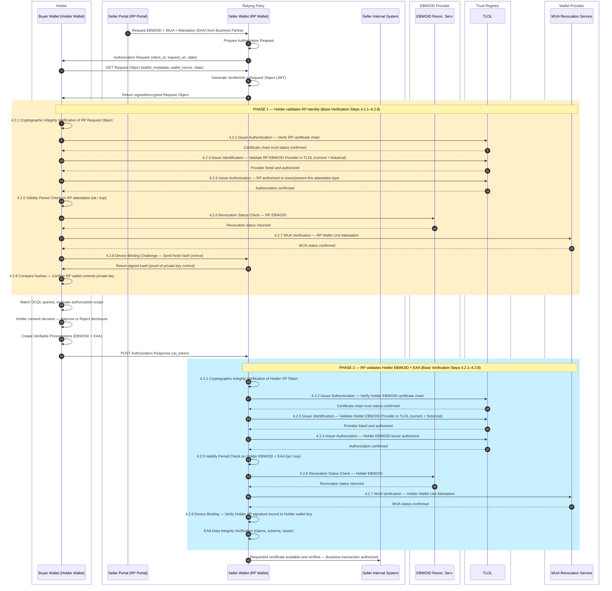
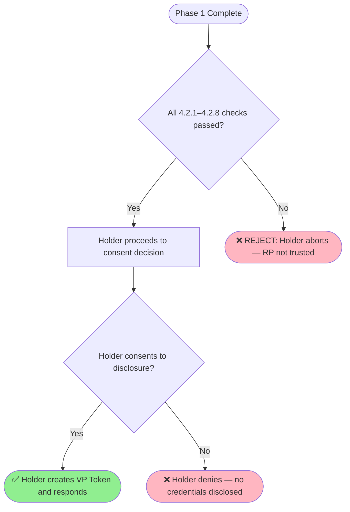
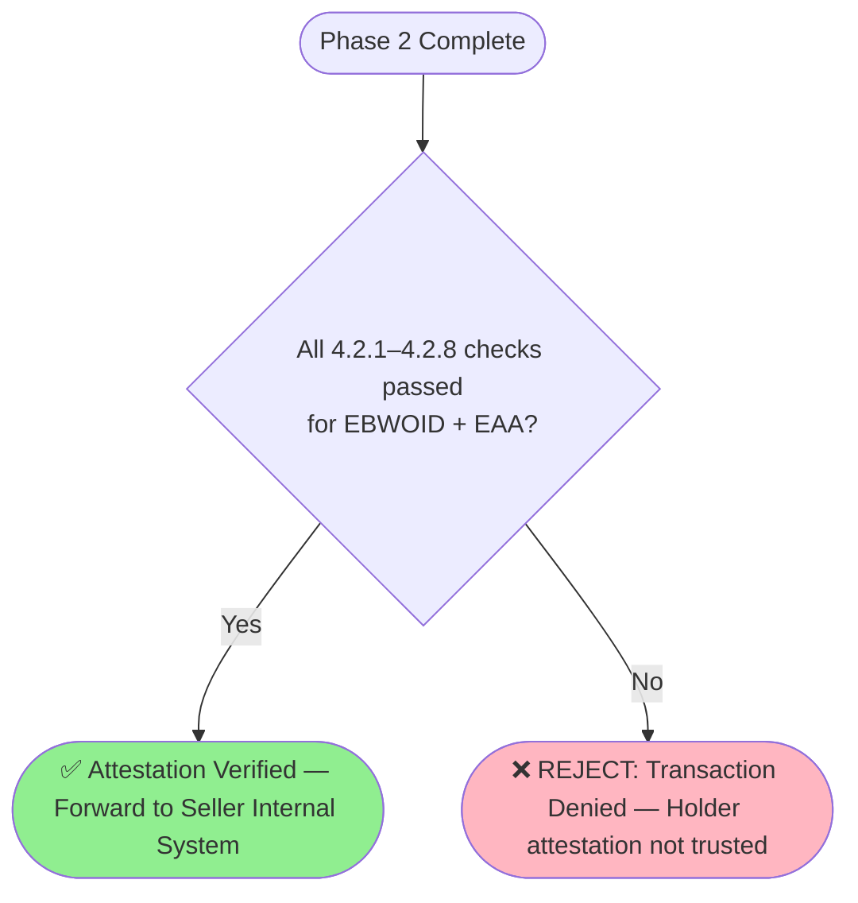

# Rulebook for Holder Authorization & Consent Handshake   
# Rulebook for Mutual Identification & Consent Handshake [What is consent handshake]
*Provide information about the author(s) of this Rulebook in the following form:*

* Author(s):
  * [Folkendt Werner , Robert Bosch GmbH]
* 
* Reviewer(s):
  * [Florin Coptil, Robert Bosch GmbH]
  * [ .... ] 

*Provide versioning information about the Rulebook in the following form:*

| Version | Date         | Description                                                     |
|---------|--------------|-----------------------------------------------------------------|
| 0.1     | 	06.05.2026	 |Initial draft based on the WeBuild design attestations meetings|
| 0.2     | 	06.05.2026	 |Updated with Base Verification integration (steps 4.2.1–4.2.8) from base-verification rulebook|

*Contact email address and/or a link to an issue tracking system that can be used for
providing feedback: werner.folkendt@de.bosch.com*
Contact: 

**Feedback:**

### 1. Introduction
   This document defines the Holder Authorization & Consent Handshake workflow, which governs the mutual authentication between a Holder Wallet (e.g. Buyer) and a Relying Party Wallet (e.g. Seller).

The workflow consists of two complementary obligations:
- Relying Party EBW backend (RP / Verifier)	MUST verify the requested Holder's attestation (EBWOID, WUA and additional (Q)EAAs) using base verification steps
- Holder	EBW backend MUST validate the RP's identity, authorization, and wallet integrity before presenting any **confidential** attestations

Relationship to Base Verification:
This document builds directly upon the base-verification rulebook. All verification steps referenced here (4.2.1–4.2.8) are fully defined in that document. The Holder Authorization & Consent Handshake applies those steps in both directions — the Holder EBW validates the RP, and the RP EBW validates the Holder EBW.

### 2. Scope
This rulebook applies to scenarios where:

- A Seller Portal (RP) [@Florin: Stimmst du der Änderung in "RP EBW backend" statt "seller portal" zu?] requests an EBWOID+WUA and/or an (Q)EAA (e.g., UBO, IBAN, Payment Terms) from a Buyer Wallet (Holder)
- Mutual trust must be established before any **confidential** credential is disclosed
- Both parties operate within a certified European Business Wallet (EBW) ecosystem [Was ist damit gemeint? EBW will not be "certified"! Muss geändert werden]

### 3. Overall Interaction Overview

The following diagram illustrates the complete mutual authentication flow and explicitly marks where base-verification steps are triggered on each side:

### 4. Workflow Phases

## 4.1 Phase 1 — Holder Validates the Relying Party
Trigger: The Holder Wallet receives a signed/encrypted Authorization Request Object from the RP Wallet.

Obligation: Before disclosing any credentials, the Holder MUST validate the RP's trustworthiness by applying the base verification steps to the RP's presented identity and attestation.

All steps below reference the base-verification rulebook for their full definition, process diagrams, and acceptance/rejection criteria.

Step	Base Verification Reference	What the Holder Checks
4.2.1	Cryptographic Integrity Verification	Signature of the RP Request Object is valid and untampered
4.2.2	Issuer Authentication Verification	RP certificate chain is complete, unbroken, and valid
4.2.3	Issuer Identification Verification	RP EBWOID Provider is listed in TLOL (current and historical)
4.2.4	Issuer Authorization Verification	RP is authorized to request this attestation type
4.2.5	Validity Period Verification	RP attestation iat and exp are within acceptable range
4.2.6	Revocation Verification	RP EBWOID has not been revoked or suspended
4.2.7	WUA Verification	RP Wallet Unit Attestation is valid and not revoked
4.2.8	Device Binding Verification	RP Wallet currently controls the private key bound to the RP EBWOID
Outcome of Phase 1:

## 4.2 Holder Consent Decision
After successfully completing Phase 1 validation, the Holder Wallet evaluates the authorization scope of the request:

| Check                | Description                                                     |
|----------------------|-----------------------------------------------------------------|
| DCQL Query Match	    |The requested credential types and attributes match what the Holder possesses
| Minimal Disclosure   |Only the attributes required for the RP's stated purpose are disclosed
| Authorization Scope  |The request does not exceed the scope the Holder has pre-authorized

User Consent	The Holder (user or automated policy) explicitly approves the disclosure
If consent is granted → the Holder creates Verifiable Presentations (VP Token) containing the EBWOID and the requested EAA(s) and sends them to the RP.
If consent is denied → the workflow terminates; no credentials are released.

## 4.3 Phase 2 — RP Validates the Holder's Attestation
Trigger: The RP Wallet receives the VP Token (Authorization Response) from the Holder Wallet.

Obligation: The RP MUST apply the full base verification steps to the Holder's presented EBWOID and EAA before accepting the transaction.

All steps below reference the base-verification rulebook for their full definition, process diagrams, and acceptance/rejection criteria.

| Step   | Base Verification Reference                                                     | What the RP Checks|
|--------|-----------------------------------------------------------------|---| 
| 4.2.1  |Cryptographic Integrity Verification	|Signature of the VP Token and all included attestations is valid
| 4.2.2	 |Issuer Authentication Verification|	Holder EBWOID certificate chain is complete, unbroken, and valid
| 4.2.3	 |Issuer Identification Verificationv	Holder EBWOID Provider is listed in TLOL (current and historical)
| 4.2.4	 |Issuer Authorization Verification|	Holder EBWOID issuer is authorized for this attestation type
| 4.2.5	 |Validity Period Verification	|Holder EBWOID and EAA iat / exp are within acceptable range
| 4.2.6	 |Revocation Verification	|Holder EBWOID and EAA have not been revoked or suspended
| 4.2.7	 |WUA Verification	|Holder Wallet Unit Attestation is valid and not revoked
| 4.2.8	 |Device Binding Verification	|The VP Token signature proves the Holder wallet controls the bound private key

Additionally for EAA verification:

| Check                         | Description                                                     |
|-------------------------------|-----------------------------------------------------------------|
| EAA Data Integrity 	          |EAA claims conform to the expected schema and data model|
| EAA Issuer Authorization	     |EAA issuer is specifically authorized for the EAA type (e.g., UBO, IBAN) per its own rulebook|
| SD-JWT Disclosure Consistency |	All selectively disclosed claims are consistent with the signed commitment|

Outcome of Phase 2:

## References 

 | **Item Reference**                           | **Standard name/details**                                                                                                                                                                                                                                                                           |
 |----------------------------------------------|-----------------------------------------------------------------------------------------------------------------------------------------------------------------------------------------------------------------------------------------------------------------------------------------------------|
 | Item Reference	                              |Standard name/details|
 | base-verification rulebook	                  |Base verification steps 4.2.1–4.2.8 — full process definitions|
 | OpenID for Verifiable Presentations (OID4VP) |	Protocol specification for presentation requests including VerifierInfo objects|
 | eIDAS 2.0 / EUDIW ARF                        |	European Digital Identity Wallet Architecture and Reference Framework|
 | WE BUILD BU1 KYC                             |Specification v0.7	Specification Scenarios|
 | EBWOID Rulebook	                             |Specific rules for EBWOID issuance, validation, and revocation|
 | TLOL / EU Trusted Lists	                     |Trust List of Trust Lists maintained by national Supervisory Bodies|
 | SD-JWT VC Specificatio                       |Format specification for Selective Disclosure JWT Verifiable Credentials|
