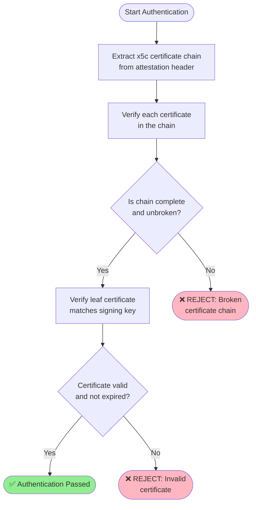
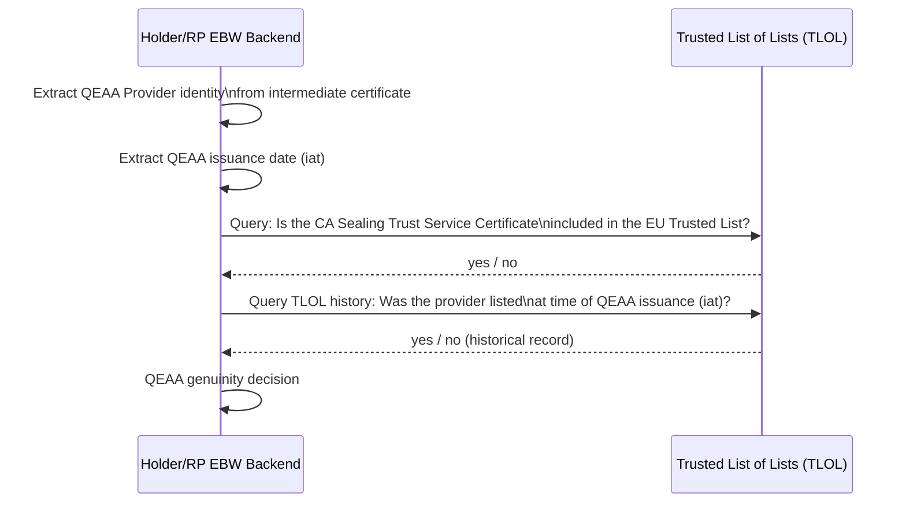
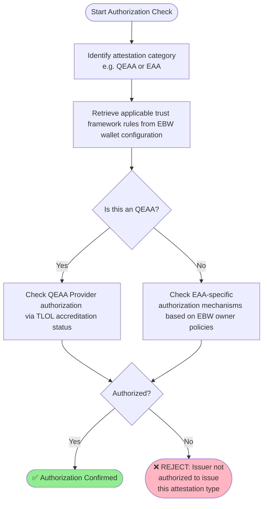
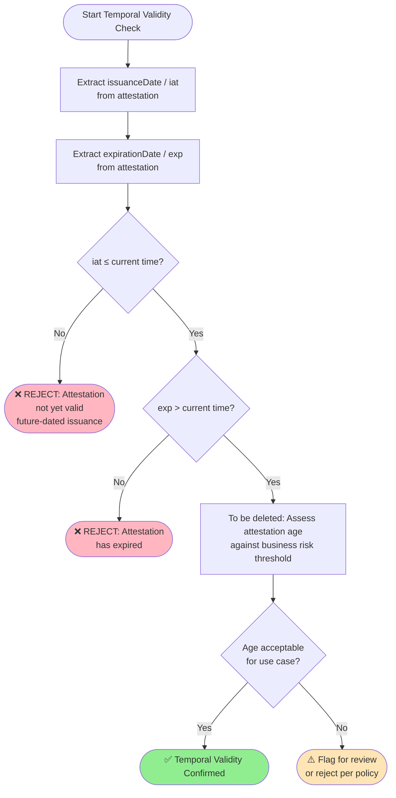
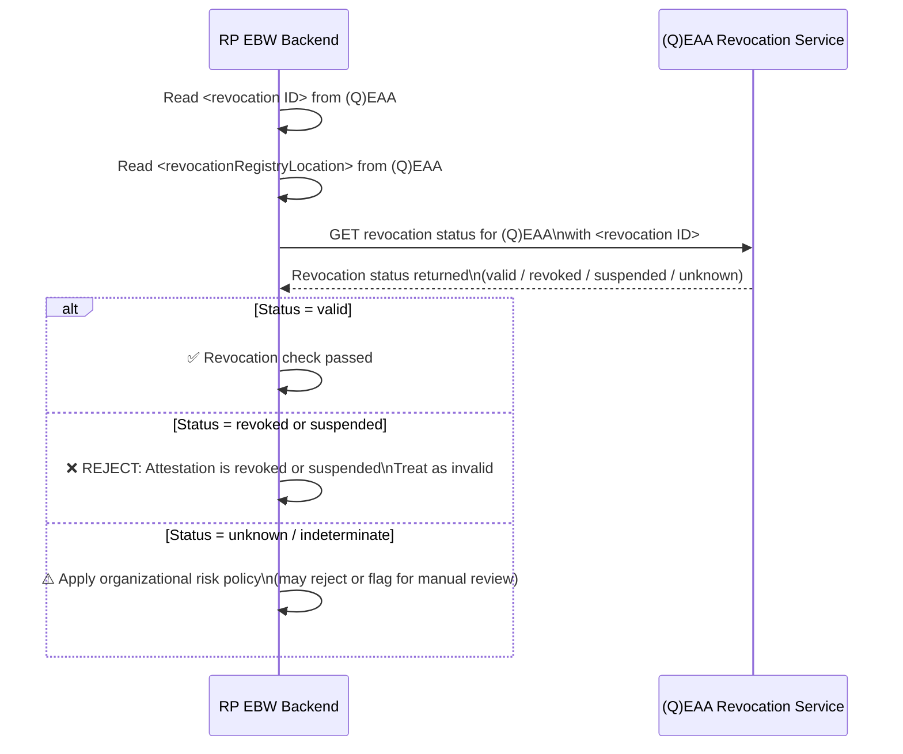
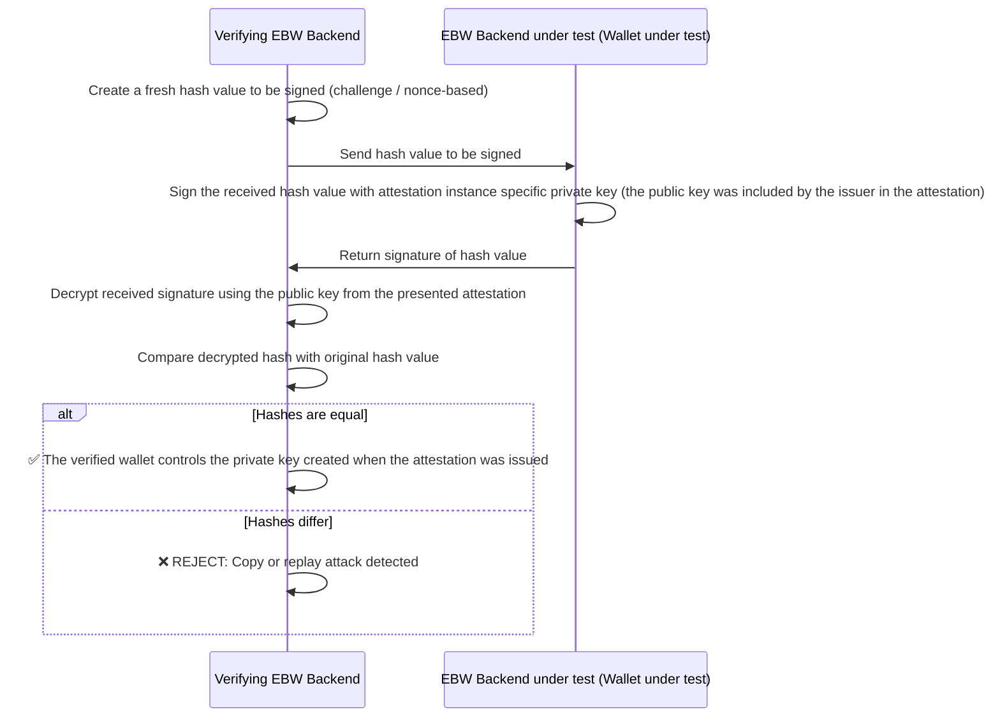

# Rulebook for common verification steps for all attestations  

*Provide information about the author(s) of this Rulebook in the following form:*

* Author(s):
  * [Folkendt Werner , Robert Bosch GmbH]
* 
* Reviewer(s):
  * [Florin Coptil, Robert Bosch GmbH]
  * [ .... ] 

*Provide versioning information about the Rulebook in the following form:*

| Version | Date       | Description                                                     |
|---------|------------|-----------------------------------------------------------------|
| 0.1     | 06.05.2026 | Initial draft based on the WeBuild attestation design meetings  |

*Provide a contact email address and/or a link to an issue tracking system that can be used for
providing feedback, e.g.:*
Contact: werner.folkendt@de.bosch.com

**Feedback:**

## Intro
When a Relying Party (RP) receives a presentation, the RP EBW must verify the received attestations from the presentation. This document defines the common verification steps that an RP EBW MUST implement for all attestations independent from their type. 

These foundational checks serve as the universal starting point for evaluating any attestation. The verification framework addresses two complementary perspectives:
- 1.Technical Validation – Verifying the attestation's cryptographic integrity and content
- 2.Issuance Process Validation – Scrutinizing how and by whom the attestation was created 
This dual approach is critical for establishing confidence and clarifying liability within the attestation ecosystem.

Important Note: 

The described verification steps define the base verification applicable to all attestations and therefore this verification steps can and MUST be implemented in the EBW wallet backend. Specific attestation types (e.g. ControllStrucure, UBO) will require and MUST define additional verification steps in their respective rulebooks. These additional verification steps MUST be implemented in internal systems. The EBW backend system MUST not implement any attestation type or use case specific funtionality. 

Some of the described verification steps differ on the implementation level for EAAs and QEAAs. 

A QEAA is defined in this document as an attestation issued by an attestation provider included in the TLOL. According to this definition EBWOID, WUA, and other attestation are considered QEAAs.

An EAA is defined in this document as an attestation provided by an EBW owner that is and can not be included in the TLOL.
The purpose and motivation (questions to be answered) of the verification steps are the same. 

Both type of attestations therefore have the same verification requirements. The differencies in the implementation of the verification requirements are described in corresponding paragraphs.

## 4.1 Issuer obligations ##

[Open topic: diagrams explaining the header of the attestations will be included and will help to understand the issuer obligations]
In this chapter mandatory rules for the metadata and the header content are defined.

According to the Architecture an Reference Framework the issuer MUST include a public key generated by the holder EBW in the payload of each attestation. 
For each attestation a separate key shall be used. The keys are signed together with the payload data by the attestation provider. The corresponding private keys are used by the Holder EBW during the presentation to the EBW RP to proof that the holder EBW is the wallet to which the presented attestations were issued (wallet binding/"copy or replay" check). This mechanism increases the security for wallet bound issued attestations significantly. The holder can proof to a relying party that he was in possession of the private key when the attestation was issued and that the attestation issuer has checked the private key possesion.

### For QEAAs:
- the header MUST includes the X509 certificate chain of the QTSP who issues the attestation. The chain contains:
  - the "root certificate"
  - the "sealing trust service certificate" as an intermediate certificate from which the different sealing certificates for different trust servides are derived. This intermediate certificate is also included in the TLOL
  - the "sealing certificate" which is used by the qTSP for signign QEAAs

### For EAAs (based on the chaining mechanism):
- the header MUST also includes a certificate chain 
- the first certificate in the chain MUST be the EBWOID (or an equivalent certificate/attestation) In the header of the EBWOID (the EBWOID is technically a QEAA) according to the the above rules the x.509 certificate chain of the EBWOID provider are included.
- the EBWOID (or an equivalent certificate/attestation) must also contain the EAA signing public key of the EBW owner. The corresponding private key is intended to be used for EAA issuing. By including this key in the EBWOID the key binding to an EUID is confirmed by a QTSP.

[Remark:The ADR "EAA provider identity verification based on chaining and TLOL" deals also with the option to use an equivalent certificate/attestation instead of the EBWOID to bind the public signing key to an EUID] 

For EAAs (that are sealed based on the QESEAL):

[this chapter still needs to be descibed]
   
## 4.2 Relying Party Obligations ##
The attestation verification process which is implemented in the RP EBW can be divided into the following 8 steps. Each step is described in one of the following chapters:

Data integrity verification step
- 4.2.1 Verification of the cryptographic integrity and signature validity of the attestation.

Issuer related verfication steps
- 4.2.2 Verification of the authenticity of the issuer (public-private key match).
- 4.2.3 Verification of the issuer’s identity
- 4.2.4 Verification that the issuer is authorized to issue the attestation.

Holder/attestation related verification steps
- 4.2.5 Verification of validity periods, expiration, and issuance timestamps.
- 4.2.6 Verification that the attestation has not been revoked or suspended.

Holder EBW related  verification steps
- 4.2.7 Verification of the wallet integrity and associated wallet attestation.
- 4.2.8 Verification that the attestation is cryptographically bound to the holder’s wallet instance.

Important note: 

During each EBW backend to EBW backend communication the first step is that both wallets perform the above steps at least for the attestations included in the verifierInfo object provided by the EBW that has initiated the communication (e.g. during a presentation request). The verifierInfo object includes at least the EBWOID and WUA attestations. That means that the above Relying Party obligation are also Holder EBW obligations. This aspect is described in the mutual identification and consent rulebook: [https://github.com/webuild-consortium/webuild-attestation-rulebooks-catalog/blob/main/rulebooks/rb-base/holder-authorization-handshake.md]

### 4.2.1 Data integrity verification ###
### Purpose
The Relying Party MUST verify that the attestation data has not been tampered with since it was issued and that the received public key corresponds to the issuers private key used during signature creation. 
This is the first and fundamental verification step. 

### Questions that are answered
- Has the attestation data received been tampered with or corrupted during transmission?
- Does the received public key corresponds to the issuers private key used during signature creation?
- [Do we need this? NO]For SD-JWT VC: Are the disclosed claims consistent with the signed payload?

### Process
1. Extract the issuer's public key from the received attestation header (e.g., from the x5c certificate chain embedded in the EBWOID header)
2. Decrypt/verify the digital signature over the attestation using the extracted public key
3. Hash the attestation payload and header and compare against the decrypted signature value
4. [Do we need this?] For SD-JWT VC:
- Verify the JWT signature
- Validate all disclosed claims against the signed commitment (hash comparison)
5. If hashes match → integrity confirmed; if not → REJECT the attestation

#### 4.2.2. Issuer related - authentication verification #### [is "authentication" the right term ? Should we use for example "genuinity"]

### Purpose
Verify that a qualified Trust Service Provider (for EAAs) or the Supervisory Body (for QÈAAs) has confirmed that the attestation issuer has owned the public key whose corresponding private key was used to sign the verified attestation. 

#### Questions that are answered
- Is the attestation “genuine”? 
- Does the attestation provider has owned the private key used to sign the received attestation when the attesation was issued?
- Does a QTSP has confirmed that an EBW owner with a specific EUID owns the private key

### Case QEAA:

Important remark: 
For QEAAs all the issuer related steps described in 4.2.2, 4.2.3 and 4.2.4 are implemented by doing a 
a complete verification of each x.509 certificate included in the header up to the root certificate. The verification requires access to the TLOL.
The above mentioned chapters describe different logical verification steps performed during header chain verification.

#### Questions that are answered during certificate chain check
- Does the certificate chain in the attestation header form a valid, unbroken chain up to a trusted root?
- Has each certificate in the chain been verified for integrity and validity?

### Process

Steps
1. Extract the x5c certificate chain from the EBWOID header
2. Perform x5c header certificate verification as performed today for a QESEAL certificate
3. Verify each certificate in the chain from leaf to root:
- Validate certificate signatures
- Check certificate validity periods
- Verify certificate usage constraints (e.g., key usage, extended key usage)
4. Confirm the leaf certificate's public key matches the key used to sign the attestation

### Case EAA (based on the chaining mechanism): 

The EBWOID is included in the header of each EAA. The EBWOID includes the public key of a key pair intended to sign EAAs. The EBWOID provider has confirmed during EBWOID issuing that this public key is owned by the EBW owner. (see 4.1. Issuer obligations).
The EBWOID is extracted and completely verified (see the 08 steps defined in this document).  If the verification of the EBWOID is successfull the public key is extracted from the payload. After this cerification step the EBW owner can be shure that the received EBWOID is "genuine" and not self issued. 

#### 4.2.3 Issuer related - identity verification ####

### Purpose
Get the name and the EUID (or another equivalent worldwide unique EBW owner identifier) associated to the issuer of the received attestation from an identity attestation (e.g. EBWOID) issued by a QTSP (for EAAs) or accessing the TLOL (for QEAAs you trust the national Supervisory Body that operates the national Trust Lists)

### Questions to be ansvered
- What is the name and the EUID of the legal entity that has issued the attestation?
- Who confirmed the name and the EUID ? Do I trust the confirmer?

### Case QEAA: 
The QEAA providers intermediate certificate is included in the TLOL and a copy is also included in the header of the QEAA. (see above issuer obligations) The certificate from the header of the QEAA is compared with the certificates included in the TLOL. This check must consider TLOL history since the TLOL may have changed since the issuance date. If the two certificates contain equal data then the verifying relying party EBW knows that the supervisory body has included the certificate in the TLOL and that he has checked the name and the EUID during this process.

### Process

Steps:
1. Extract the QEAA Provider's intermediate certificate from the header of the QEAA
2. Retrieve the QEAA issuance date (iat claim)
3. Query the TLOL: Is a copy of the extracted intermediate certificate (the CA Sealing Trust Service Certificate) included in the EU Trusted List?
4. Additionally check TLOL history: Was the QEAA Provider listed in the TLOL at the time the EBWOID was issued?
5. If both current and historical checks pass → QEAA genuinity confirmed
6. If either check fails → REJECT

### Case EAA (based on the chaining mechanism)
The EBWOID is included in the header of each EAA. The EBWOID is extracted and completely verified (see the 08 steps defined in this document). If the verification is successfull the name and the EUID (or another equivalent worldwide unique EBW owner identifier) is extracted and the EBW owner knows who the issuer of the verified EAA is. He can also be shure that the received EBWOID is not self issued. (The EBW has verified also the QEAA provider identity data included in the EBWOID header) Based on this knowledge further decisions can be made according to the EBW owner company policies.

#### 4.2.4 Issuer related - authorization verification #### 

### Purpose
Verify that the issuer is authorized to issue the specific type of attestation being presented (e.g., EBWOID, UBO, ...) based on EBW owner  internal policies (not every issuer will be trusted by an EBW owner). RBW owner internal policies consider also the EU and national regulation.

The authorization verification is based on the issuer identity data provided with the identity certificates/attestation included in the header of the attestation. This verification steps goes beyond identity verification and verifies for QEAAs whether the issuer has the legal and regulatory right to issue the specific attestation based on the TLOL.

### Questions to be answered
- Is the issuer authorized and competent to issue the specific type of attestation according to the EBW owner internal policies?

### Process 

### Steps
1. Identify the type of attestation being verified (QEAA or EAA)
2. Retrieve the applicable trust framework rules for that attestation type (see Chapter 5)
3. For QEAA: Verify that the QEAA Provider's accreditation in the TLOL that explicitly covers the authorization to issue QEAAs
4. For EAA (e.g., UBO): Confirm issuer authorization mechanisms based on EBW owner policies specific to that EAA type 
6. If all authorization checks pass → proceed; otherwise → REJECT

### Case QEAA:
A QEAA provider is accredited by the National Accreditation Body and has to proof his competence and conformance to regulation periodically. He is included in the TLOL. Therefore the EBW owner simply has to check:
- if the intermediate certificate of the QEAA provider is included in the TLOL
- if the QEAA provider is whitelisted by the EBW owner according to internal policies (e.g. by checking EBW internal configuration, ...)

### Case EAA: 
The authorization verification is based on the issuer identity data provided with the EBWOID included in the header of the attestation and additional data related the issuer available in the verified EAA. The authorization verification is done based on the EBW owner internal policies. That can be done for example by accessing the corresponding wallet configuration created based on the EBW owners policies by the EBW owner. This wallet configuration can be created manually or by accessing a trusted jurisdiction/domain specific trust list service where the issuers for this type of EAA are listed by a trusted "trust anchor" entity. 

#### 4.2.5 Holder/attestation related - validity verification ####
#### Purpose
Verify that the attestation is within its stated validity window. An attestation that has not yet taken effect or has already expired MUST NOT be accepted, regardless of other checks.

#### Questions to be Covered
1. Was the attestation issued in the past (not a future-dated attestation)?
2. Has the attestation's expiration date been reached?
3. How does the attestation's age factor is included into business risk considerations? [This step has to be deleted. It is not a common verification step needed by all attestations]

Process

Steps
1. Extract the issuanceDate / iat (issued at) claim from the attestation
2. Extract the expirationDate / exp (expiration) claim from the attestation
3. Verify iat ≤ current time:
- If iat is in the future → REJECT (attestation not yet valid / future-dated)
  Verify exp > current time:
- If current time has passed exp → REJECT (attestation has expired)
5. [Remove step 5] Consider attestation age in relation to business risk:
- For high-risk operations (e.g., large financial transactions), even a recently-issued but older attestation may warrant additional scrutiny
- Apply organizational policy for acceptable attestation age thresholds

#### 4.2.6 Holder/attestation related - revocation verification ####
### Purpose
The purpose of this step is to check if the received attestation was revoked by the attestation provider since the issuance date.  

### Questions to be answered
- Has the attestation been revoked by its issuer?
- What is the revocation mechanism used (e.g., status list, revocation registry)?
- How should suspended or indeterminate status be handled?

Process

Steps
1. Read the <revocation ID> from the (Q)EAA
2. Read the <revocationRegistryLocation> from the (Q)EAA
3. Query the designated revocation/status service at the specified location
4. Evaluate the returned status:
- Valid → proceed
- Revoked or Suspended → REJECT, treat as invalid
- Unknown/Indeterminate → handle according to organizational risk policy
5. Apply the revocation decision to the overall attestation validation outcome

Important note:
The EBW MUST NOT implement EBW owner specific risk policies during verification. The attestation is transferred to the requesting internal system that may perform additional checks.

#### 4.2.7 EBW related - WUA verification ####
### Purpose
This verification step is required to check authentication and validation of the EBW unit components by requesting and verifying the Wallet Unit Attestation.

According to EU Business Wallet regulation Article 14/2/b"...Wallet units shall enable authentication and validation of the Wallet unit components by presenting the Wallet unit attestations..."

### Questions to be answered
1. Are the wallet unit components authentic and valid?
2. Is the wallet still valid or has it been revoked? Has the WUA been revoked?
3. Do I (as an EBW owner in the Holder role) realy have received a request from another EBW relying party and not from another software (e.g. Relying Party component?

The Wallet Unit Attestation also confirms to an EBW owner acting in the Holder role that he has received a request form another EBW and not for example from a Relying Party component used for example to communicate with EUDI wallets for natural persons. The WUA is part of the verifierInfo object included in each EBW RP request to enable mutual authentication (see ...link to mutual authentication) The EBW wallet is much more secure and prevent impersonation fraud much better than an unknown, uncertified Relying Party software without any conformity declaration. Therefore several EBW owner will deny any request for confidential data (e.g. UBO,...) received from Relying Party software.

### Process 
Steps
1. Extract the WUA from the received presentation
2. Performs the general EAA verification steps 4.2.1.- 4.2.6 for the WUA
3. If any check fails → REJECT

### 4.2.8. Holder wallet related - device binding ("copy or reply") verification ####

### Purpose
The purposes of this check are:
- to avoid that a holder presents a copied or replayed attestation.  (e.g. he presents a copied EBWOID of another EBW owner)
- to check that the presented attestation was issued to this wallet instance

This check prevents a malicious actor from copying an attestation and replaying it from a different wallet instance.
It also confirms to the verifying EBW owner, that the attestation issuer has issued ths attestation several time ago to this wallet.

### Questions to be Covered
- Does the presenting wallet currently controls the private key associated with the public key embedded in the attestation by the attestation provider?
- Was the (Q)EAA issued to this specific wallet (wallet-bound issuance)?
- Was the Holder EBW backend in possession of the public and private key pair at the time the attestation was issued?

Important notes:

1. According to ARF1.3 6.3.2.4 Relying Party trusts device binding
“…Note that a EUDI Wallet Instance can contain multiple attestations, originating from multiple Providers. For each attestation, the EUDI Wallet Instance has access to an attestation private key, which is stored in the WSCD in (or connected to) the User's device. As discussed in section 6.2.2, the EUDI Wallet Instance also contains a EUDI Wallet Instance private key. Depending on the attestation requested by the 6.3.2.4, the EUDI Wallet Instance SHALL use the correct private key for signing the random number generated by the Relying Party.”

2. This check is also performed by a Holder wallet after it has received a request for confidential attestations from another EBW backend. The requesting EBW will include a verifierInfo object containing at least the EBWOID and WUA. During the EBWOID and WUA verification the requesting wallet also needs to pass this check.

### Process

Steps
Prerequisites: the verifying wallet has received an attestation 
1. The verifying wallet backend creates a fresh hash value (challenge) to be signed
2. The hash value is sent to the Holder wallet that has presented the attestation
3. The Holder wallet signs the received hash value with the private key. The corresponding public key was included by the issuer in the attestation.
4. The signature is returned to the verifying wallet
5. The verifying wallet decrypts the received signed hash using the public key included in the attestation by the issuer
6. If the two hash values are equal → the presenting wallet controls the attestation instance specific private key and the attestation provider has issued the attestation to this specific wallet
7. If not equal → REJECT (copy or replay attack)

## References

| **Item Reference**                            | **Standard name/details**                                                                                                                                                                                                                                                                           |
|-----------------------------------------------|-----------------------------------------------------------------------------------------------------------------------------------------------------------------------------------------------------------------------------------------------------------------------------------------------------|
| OpenID for Verifiable Presentations (OID4VP)	 |Protocol specification for presentation requests including VerifierInfo objects|
| eIDAS 2.0 / EUDIW ARF                         |	European Digital Identity Wallet Architecture and Reference Framework|
| WE BUILD BU1 KYC Specification v0.7	          |Specification Scenarios |
| EBWOID Rulebook	                              |Specific rules for EBWOID issuance, validation, and revocation|
| TLOL / EU Trusted Lists	                      |Trust List of Trust Lists maintained by national Supervisory Bodies|
| SD-JWT VC Specification	                      |Format specification for Selective Disclosure JWT Verifiable Credentials|

