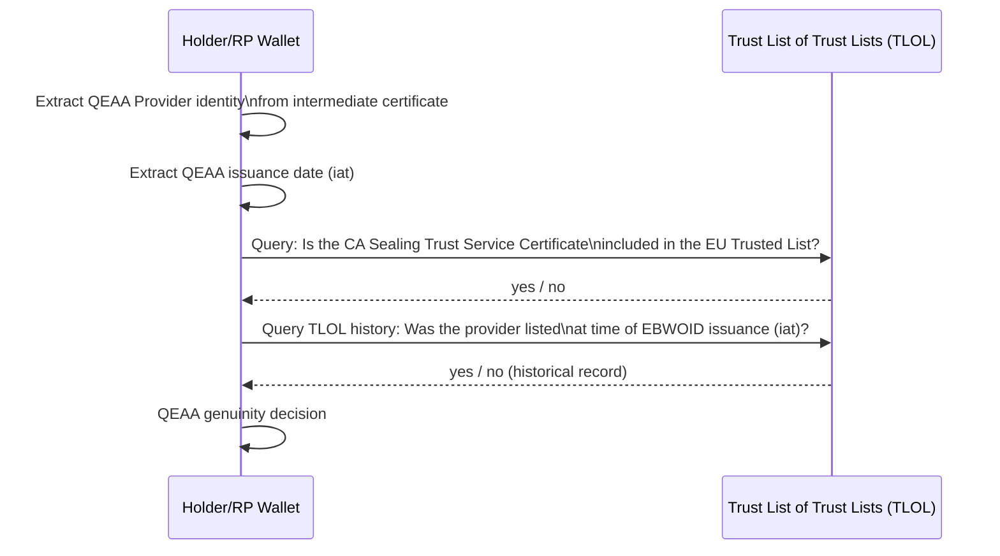
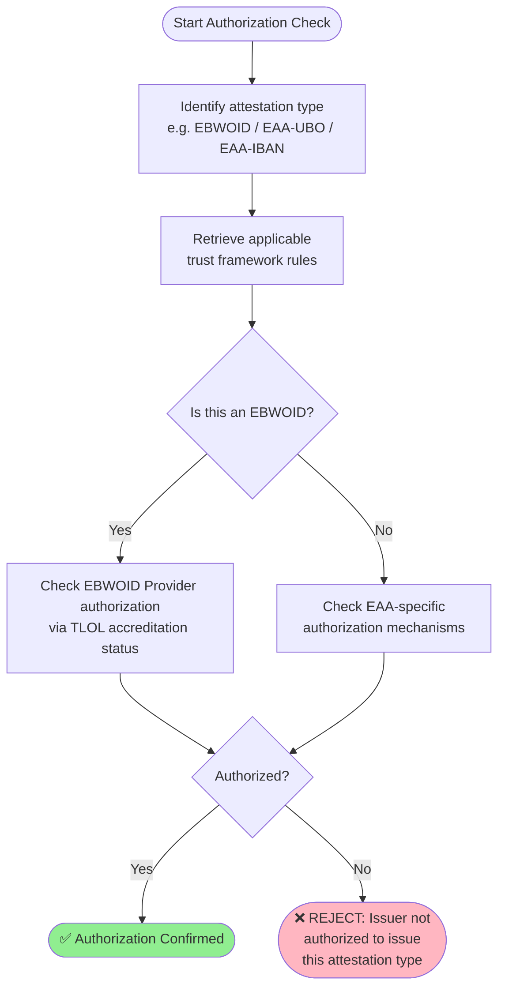
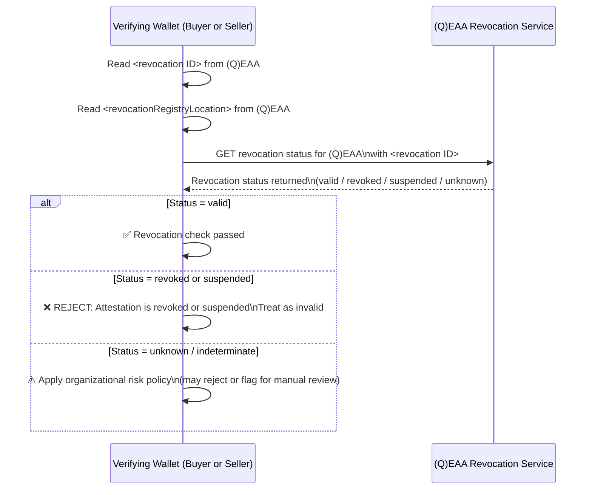
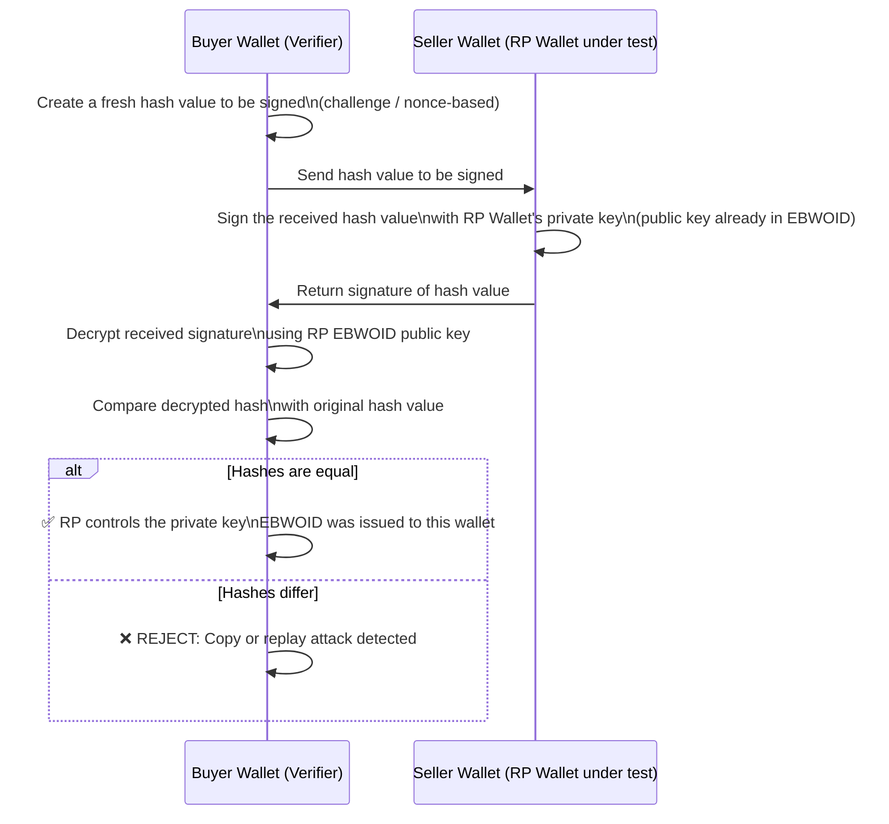

# Rulebook for common verification steps for all attestations  

*Provide information about the author(s) of this Rulebook in the following form:*

* Author(s):
  * [Folkendt Werner , Robert Bosch GmbH]
* 
* Reviewer(s):
  * [Florin Coptil, Robert Bosch GmbH]
  * [ .... ] 

*Provide versioning information about the Rulebook in the following form:*

| Version | Date       | Description                                                     |
|---------|------------|-----------------------------------------------------------------|
| 0.1     | 06.05.2026 | Initial draft based on the WeBuild attestation design meetings  |

*Provide a contact email address and/or a link to an issue tracking system that can be used for
providing feedback, e.g.:*
Contact: werner.folkendt@de.bosch.com

**Feedback:**

## Intro
When a Relying Party (RP) receives a presentation, the RP EBW must verify the received attestations from the presentation. This document defines the common verification steps that an RP EBW MUST implement for all attestations independent from their type. 

These foundational checks serve as the universal starting point for evaluating any attestation. The verification framework addresses two complementary perspectives:

[ Do we need this paragraph? No!
- 1.Technical Validation – Verifying the attestation's cryptographic integrity and content
- 2.Issuance Process Validation – Scrutinizing how and by whom the attestation was created and takin
This dual approach is critical for establishing confidence and clarifying liability within the attestation ecosystem. While the initial steps provide a common baseline, more intricate attestations (e.g., EBWOID, WUA, UBO) may necessitate additional verification measures beyond what is described here.]

Important Note: The described verification steps define the base verification applicable to all attestations and therefore this verification steps can and MUST be implemented in the EBW wallet backend. Specific attestation types (e.g. ControllStrucure, UBO) may require and MUST define additional verification steps in their respective rulebooks. These additional verification checks MUST be implemented in internal systems. The EBW backend system MUST not implement any attestation type or use case specific funtionality. 

Some of the described verification steps differ on the implementation level for EAAs and QEAAs. However the purpose and motivation (questions to be answered) of the verification steps are the same. The differencies are described in corresponding paragraphs.

Assumptions related the content of the header of each attestation are:
For QEAA (e.g. EBWOID):
- the header includes the X509 certificate chain of the QTSP who issues the attestation. The chain contains:
  - the "root certificate"
  - the "sealing trust service certificate" as an intermediate certificate from which the different sealing certificates for different trust servides are derived. This intermediate certificate is also included in the TLOL
  - the "sealing certificate" which is used by the qTSP for signign QEAAs
For EAA (e.g. IBAN,UBO,...):
- the header also includes a certificate chain 
- the first certificate in the chain is the EBWOID (or an equivalent x.509 certificate) In the header of the EBWOID the above described x.509 certificates are included.
   
## 4.2 Relying Party Obligations ##
The attestation verification process which is implemented in the RP EBW can be divided into the following 8 steps:
Data integrity verification step
- Verification of the cryptographic integrity and signature validity of the attestation.
Issuer related verfication steps
- Verification of the authenticity of the issuer.
- Verification of the issuer’s identity and identifier information.
- Verification that the issuer is authorized to issue the attestation.
Holder related verification steps
- Verification of validity periods, expiration, and issuance timestamps.
- Verification that the attestation has not been revoked or suspended.
 Holder EBW related  verification steps
- Verification of the wallet integrity and associated wallet attestation.
- Verification that the attestation is cryptographically bound to the holder’s device or wallet instance.

### 4.2.1 Data integrity verification ###
### Purpose

The Relying Party MUST verify that the attestation data has not been tampered with since it was issued and that the received public key corresponds to the issuers private key used during signature creation. 
This is the first and fundamental verification step. 

### Questions that are answered
- Has the attestation data received been tampered with or corrupted during transmission?
- Does the received public key corresponds to the issuers private key used during signature creation?
- For SD-JWT VC: Are the disclosed claims consistent with the signed payload?

Steps
1. Extract the issuer's public key from the received attestation header (e.g., from the x5c certificate chain embedded in the EBWOID header)
2. Decrypt/verify the digital signature over the attestation using the extracted public key
3. Hash the attestation payload and header and compare against the decrypted signature value
4. For SD-JWT VC:
- Verify the JWT signature
- Validate all disclosed claims against the signed commitment (hash comparison)
5. If hashes match → integrity confirmed; if not → REJECT the attestation

#### 4.2.2. Issuer Related - authentification verification ####

### Purpose
Verify that a qualified Trust Service Provider has confirmed that the attestation issuer has owned the public key whose corresponding private key was used to sign the verified attestation. This is analogous to the verification performed today for a QESEAL certificate in which a QTSP confirms that a public key is owned by the QESEAL. 

#### Questions that are answered
- Is the attestation “genuine”? Does the attestation provider has owned the private key used to sign the received attestation when the attesation was issued?

Case QEAA:
Important remark: For QEAAs all the issuer related steps described in 4.2.2, 4.2.3 and 4.2.4 are implemented by doing a 
a complete verification of each x.509 certificate included in the header up to the root certificate based on the TLOL.
The above mentioned chapters describe different logical verification steps performed during header chain verification.
#### Questions that are answered during certicate chain check
- Does the certificate chain in the attestation header form a valid, unbroken chain up to a trusted root?
- Has each certificate in the chain been verified for integrity and validity?
### Process

Steps
1. Extract the x5c certificate chain from the EBWOID header
2. Perform x5c header certificate verification as performed today for a QESEAL certificate
3. Verify each certificate in the chain from leaf to root:
- Validate certificate signatures
- Check certificate validity periods
- Verify certificate usage constraints (e.g., key usage, extended key usage)
4. Confirm the leaf certificate's public key matches the key used to sign the attestation

Case EAA: check if the public attesed by 3rd Party (attestation chaining)

#### 4.2.3 Issuer related - identity verification ####

### Purpose
Get the name and the EUID of the issuer of the received attestation from an identity attestation (EBWOID) issued by a QTSP (for EAAs) or accessing the TLOL (for QEAAs you trust the national Supervisory Body that operates the national Trust Lists) 

### Questions to be ansvered
- What is the name and the EUID of the legal entity that has issued the attestation
- Who confirmed the name and the EUID ?

Case QEAA:
issued by a  x.509 certificate or and that they were listed in the Trust List of Trust Lists (TLOL) at the time the attestation was issued. This check must consider TLOL history since the TLOL may have changed since issuance.
Verify that the EBWOID Provider is the entity they claim to be, and that they were listed in the Trust List of Trust Lists (TLOL) at the time the attestation was issued. 

Case QEAA: 
The QEAA providers intermediate certificate is included in the TLOL and a copy is also included in the header of the QEAA. The certificate from the header of the QEAA is compared with the certificates included in the TLOL. This check must consider TLOL history since the TLOL may have changed since the issuance date. If the two certificates contain equal data then the verifying relying party EBW knows that the supervisory body has included the certificate in the TLOL and that he has checked the name and the EUID during this process.

Case QEAA: 
Case EAA: exract from header the EBWOID - find public key and check against the TLOL + Historie 

### Process

### Steps
1. Extract the QEAA Provider's intermediate certificate from the header of the QEAA
2. Retrieve the QEAA issuance date (iat claim)
3. Query the TLOL: Is a copy of the extracted intermediate certificate (the CA Sealing Trust Service Certificate) \nincluded in the EU Trusted List?
4. Additionally check TLOL history: Was the QEAA Provider listed in the TLOL at the time the EBWOID was issued?
5. If both current and historical checks pass → QEAA genuinity confirmed
6. If either check fails → REJECT

Case EAA (based on the chaining mechanism)
The EBWOID is included in the header of each EAA. The EBWOID is extracted and completely verified (see the 08 steps defined in this document). If the verification is successfull the name and the EUID is extracted and the RP EBW knows who the issuer of the verified EAA is, further decisions can be made

#### 4.2.4 Issuer related - authorization verification ####

### Purpose
Verify that the issuer is authorized to issue the specific type of attestation being presented (e.g., EBWOID, UBO, ...) based on regulation and especially on EBW relying party internal policies (not every issuer will be trusted by an EBW owner). 

The authorization verification is based on the issuer identity data provided with the identity certificates/attestation included in the header of the attestation and additional This goes beyond identity verification to check whether the issuer has the legal and regulatory right to issue the specific attestation.

### Questions to be answered
- Is the issuer authorized and competent to issue the specific type of attestation according to the EBW owner internal policies?

Case QEAA:
A QEAA provider is accredited by the National Accreditation Body and has to proof his competence and conformance to regulation periodically. He is included in the TLOL. Therefore the EBW relying party simply has to check:
- if the intermediate certificate of the QEAA provider is included in the TLOL
- if the QEAA provider is whitelisted according to internal policies (e.g. by checking EBW internal configuration, ...)

Case EAA: 
The authorization verification is based on the issuer identity data provided with the EBWOID included in the header of the attestation and additional data related the issuer available in the verified EAA. The authorization verification is done based on the EBW owner internal policies. (e.g. by checking EBW internal configuration created based on the EBW Owner policies, ...). 

### Process [muss komplett überarbeitet werden oder gelöscht werden)

### Steps [muss komplett überarbeitet oder gelöscht werden]
1. Identify the type of attestation being verified (QEAA or EAA)
2. Retrieve the applicable trust framework rules for that attestation type (see Chapter 5)
3. For EBWOID: Verify that the EBWOID Provider's accreditation in the TLOL explicitly covers the authorization to issue EBWOIDs
4. For EAA (e.g., UBO): Confirm issuer authorization mechanisms specific to that EAA type:
Check the issuer's credentials against the appropriate trust framework
Verify the issuer is listed as an authorized EAA issuer for the relevant jurisdiction/domain
5. If all authorization checks pass → proceed; otherwise → REJECT

#### 4.2.5 Holder Related - Validity Verification ####
#### Purpose
Verify that the attestation is within its stated validity window. An attestation that has not yet taken effect or has already expired MUST NOT be accepted, regardless of other checks.

#### Questions to be Covered
1. Was the attestation issued in the past (not a future-dated attestation)?
2. Has the attestation's expiration date been reached?
3. How does the attestation's age factor is included into business risk considerations? [This step has to be deleted. It is not a common verification step needed by all attestations]

Process

Steps
1. Extract the issuanceDate / iat (issued at) claim from the attestation
2. Extract the expirationDate / exp (expiration) claim from the attestation
3. Verify iat ≤ current time:
- If iat is in the future → REJECT (attestation not yet valid / future-dated)
  4Verify exp > current time:
- If current time has passed exp → REJECT (attestation has expired)
5. [Remove step 5] Consider attestation age in relation to business risk:
- For high-risk operations (e.g., large financial transactions), even a recently-issued but older attestation may warrant additional scrutiny
- Apply organizational policy for acceptable attestation age thresholds

#### 4.2.6 Holder related - revocation verification ####
### Purpose
Answer the question only for revocable attestations: Was the attestation revoked since the beginning of the validity period?

A cryptographically valid attestation from an authenticated issuer may still be invalid if the issuer has explicitly revoked it (e.g., due to key compromise, legal changes, or business relationship termination).

### Questions to be answered
- Has the attestation been revoked by its issuer?
- What is the revocation mechanism used (e.g., status list, revocation registry)?
- How should suspended or indeterminate status be handled?

Process

Steps
1. Read the <revocation ID> from the EBWOID (or EAA)
2. Read the <revocationRegistryLocation> from the EBWOID (or EAA)
3. Query the designated revocation/status service at the specified location
4. Evaluate the returned status:
- Valid → proceed
- Revoked or Suspended → REJECT, treat as invalid
- Unknown/Indeterminate → handle according to organizational risk policy
5. Apply the revocation decision to the overall attestation validation outcome

#### 4.2.6. Holder EBW related - WUA verification ####
### Purpose
This verification step is required to enable authentication and validation of the Wallet unit components by presenting the Wallet Unit Attestation
According to EU Business Wallet regulation Article 14/2/b"...Wallet units shall enable authentication and validation of the Wallet unit components by presenting the Wallet unit attestations..."
The Wallet Unit Attestation also confirms to EBW owner acting in the Holder role that he has received a request form another EBW and not for example from a Relying Party component used for example to communicate with EUDI wallets for natural persons. The EBW wallet is much more secure and prevent impersonation fraud much better than an unknown, uncertified Relying Party software twithout any conformity declaration.
These checks verify the integrity and authenticity of the wallet instance presenting the attestation. The goal is to prevent impersonation, copy attacks, and replay attacks by confirming that:
### Questions to be answered
1. Are the wallet unit components authentic and valid?
2. Do I (as a Holder Wallet) realy have received a request from another EBW relying party and not from another software (e.g. Relying Party component?
   
4. Does the WUA confirm the wallet is a certified EBW instance?
The wallet presenting the EBWOID actually controls the private key bound to it (device/wallet binding)
The Wallet Unit Attestation (WUA) confirms the wallet is a legitimate, certified EBW instance

"The EBW wallet is much more secure and prevent impersonation fraud much better than an unknown, uncertified Relying Party software without any conformity declaration."
The WUA is a certified attestation issued by the Wallet Provider that proves the wallet instance is a legitimate, certified, and conformant European Business Wallet.

### Questions to be Covered
1. Is the Wallet Unit Attestation (WUA) cryptographically valid?
2. Has the WUA been revoked?
3. Does the WUA confirm the wallet is a certified EBW instance?

Process

Steps
1. Extract the WUA from the received VerifierInfo object (included by the RP in the presentation request) or from the Holder's presented credentials
2. Apply 4.2.1 Cryptographic Integrity check on the WUA
3. Apply 4.2.2 Issuer Validation on the WUA (verify the Wallet Provider's identity and authorization)
4. Query the WUA Revocation Service to confirm the WUA has not been revoked
5. Verify the WUA's validity dates (issuance and expiration)
   If all checks pass → wallet confirmed as authentic and valid EBW
7. If any check fails → REJECT

### 4.2.8. Holder Wallet Related - Device binding Verification ####

### Purpose
Answer the question: Does the EBW Relying Party wallet control, at the moment of the check, the private key associated with the public key from the EBWOID?

This check prevents a malicious actor from copying an EBWOID and replaying it from a different wallet instance.

### Questions to be Covered
- Does the presenting wallet currently control the private key associated with the public key embedded in the EBWOID?
- Was the EBWOID issued to this specific wallet (wallet-bound issuance)?
- Was the Relying Party in possession of the public and private key pair at the time the EBWOID was issued?

### Process

Steps
1. The verifying wallet (Buyer Wallet) creates a fresh hash value (challenge) to be signed
2. The hash value is sent to the Relying Party wallet (Seller Wallet)
3. The Seller Wallet signs the received hash value with its private key (the corresponding public key is already included in the EBWOID)
4. The signature is returned to the Buyer Wallet
5. The Buyer Wallet decrypts the received signed hash using the RP EBWOID public key
6. If the two hash values are equal → the requesting RP controls the private key and the EBWOID provider has issued the EBWOID to this specific RP EBW instance
7. If not equal → REJECT (copy or replay attack)

## References

| **Item Reference**                            | **Standard name/details**                                                                                                                                                                                                                                                                           |
|-----------------------------------------------|-----------------------------------------------------------------------------------------------------------------------------------------------------------------------------------------------------------------------------------------------------------------------------------------------------|
| OpenID for Verifiable Presentations (OID4VP)	 |Protocol specification for presentation requests including VerifierInfo objects|
| eIDAS 2.0 / EUDIW ARF                         |	European Digital Identity Wallet Architecture and Reference Framework|
| WE BUILD BU1 KYC Specification v0.7	          |Specification Scenarios |
| EBWOID Rulebook	                              |Specific rules for EBWOID issuance, validation, and revocation|
| TLOL / EU Trusted Lists	                      |Trust List of Trust Lists maintained by national Supervisory Bodies|
| SD-JWT VC Specification	                      |Format specification for Selective Disclosure JWT Verifiable Credentials|

